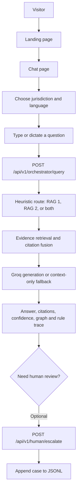
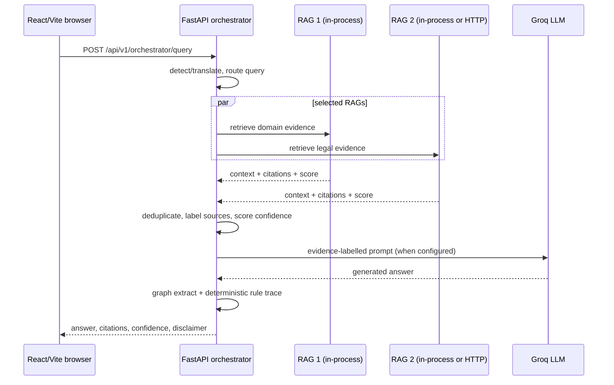
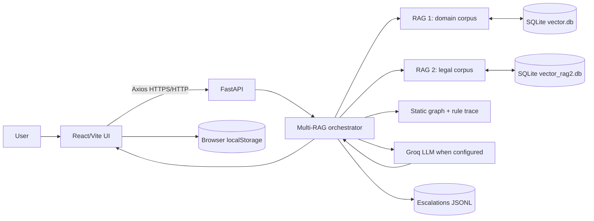

# IP1 — Technical Architecture & End-to-End System Analysis

## 1. Executive Summary

IP1 is a full-stack **Ayurveda, intellectual-property, and regulatory research assistant**. It has a React browser application and a FastAPI backend. The backend contains two local retrieval corpora:

- **RAG 1**: Ayurveda and IP domain context.
- **RAG 2**: legal and regulatory evidence with statutory metadata such as jurisdiction, document type, section/rule/article, and effective dates.

The normal chat path sends a user query to a heuristic router, retrieves from one or both corpora, labels and de-duplicates citations, then asks a Groq-hosted LLM to write a response from that evidence. The API also returns a deterministic confidence score, a fixed in-memory relation graph, and a rule-evaluation trace. Browser chat history is kept locally; the backend has no verified user-account system.

**Evidence status:** This document is based on the IP1 source, manifests, configuration, and a visual review of the supplied 4:27 video. It does not establish that any configured service is deployed or that optional credentials have been supplied.

## 2. What the System Does

**Verified:** A visitor can use a web chat interface to ask a question, select India or International jurisdiction, choose a response language, choose automatic or manual RAG routing, inspect research results, request voice input, and submit an answer/evidence trail for human review.

For a standard chat message, the frontend calls `POST /api/v1/orchestrator/query`. The backend can:

1. detect and, conditionally, translate a non-English query for retrieval;
2. route the query to the domain corpus, legal corpus, or both;
3. retrieve evidence using BM25 plus TF–IDF/cosine similarity and reciprocal-rank fusion;
4. create an LLM prompt containing labelled evidence;
5. call Groq when `GROQ_API_KEY` is configured, otherwise return a template built from retrieved context;
6. return citations, confidence, a legal disclaimer, a graph extract, and a deterministic rule trace.

It is therefore a retrieval-grounded assistant, but not a guarantee that an answer is correct or legally complete. The code itself includes a legal-information disclaimer.

## 3. Verified Feature Set

| Feature | Execution path | Status |
|---|---|---|
| Two-corpus chat retrieval | `Chat.jsx` → `/orchestrator/query` → `MultiRAGOrchestratorService` → local RAG connectors | Verified |
| Automatic intent routing | `QueryRouter` uses regular expressions and keyword lists to select RAG 1, RAG 2, or both | Verified |
| Manual RAG selection | Chat answer settings provide registered-RAG checkboxes and pass `target_rags` | Verified |
| Legal and domain research tools | Modal UI calls health, search, direct query, route preview, historical lookup, and document metadata endpoints | Verified |
| Hybrid retrieval | Custom BM25 + TF–IDF n-gram/cosine retrieval; custom reciprocal-rank fusion | Verified |
| Legal filters | RAG 2 supports category, domain, jurisdiction, historical date, and result limit fields | Verified |
| Citations and source links | Backend returns citation objects; frontend renders safe HTTP(S) links | Verified |
| Confidence / escalation recommendation | Orchestrator derives a score from route confidence and retrieval scores | Verified |
| Human-review queue | `/human/escalate` appends a case record to JSONL | Verified |
| Voice input | Browser recording → `/voice/transcribe` → Groq Whisper, with Deepgram fallback; browser speech recognition fallback exists client-side | Verified, conditional on browser/provider configuration |
| Multilingual flow | Supported-language list, local Indic lexicon, optional Bhashini, and optional Groq translation | Verified, provider-dependent |
| Historical legal lookup | RAG 2 filters retrieved provisions by recorded effective dates | Verified |
| Static knowledge graph and rule trace | In-memory graph → rule-set evaluator → response fields | Verified |
| Runtime external-RAG registration | Form/API registers an HTTP connector until the backend process restarts | Verified |

## 4. User Flow

1. The visitor opens the React landing page and moves to `/chat`.
2. The chat page loads supported languages and currently registered RAG services from the API. It also restores local browser chat history.
3. The visitor selects **India** or **International**, chooses a language, and either types a question or uses the microphone.
4. The frontend submits the message to the orchestration endpoint with the selected jurisdiction, language, result count, and any manually chosen RAGs.
5. The backend optionally normalizes/translates the retrieval query, decides the target RAGs unless they were explicitly provided, and queries targets concurrently.
6. The backend merges duplicate evidence, gives statutory sources priority during sorting, supplies evidence to the LLM/generator, and returns structured response data.
7. The UI renders the answer, source cards, confidence badge, graph/rule panels when supplied, and a human-escalation action when appropriate.
8. Deleting a chat removes it only from browser storage. It does not call a backend deletion endpoint.

## 5. End-to-End Technical Workflow

### Routing and retrieval

`QueryRouter` is deterministic rather than model-based. It matches conceptual, legal, and hybrid patterns, then falls back to lists of legal/domain terms. An explicit `target_rags` request overrides that decision. International queries are forced to the legal RAG by the orchestrator.

RAG 1 and RAG 2 both build their retrieval indexes at application startup. They first load SQLite data if the relevant database is populated; otherwise they ingest checked-in raw corpora. Their hybrid mode uses BM25 and a **TF–IDF word/bigram vectorizer**. The code calls this a vector/dense retriever, but no neural embedding model, hosted vector database, sentence-transformer, or reranker is present in IP1.

### Generation and fallback

The orchestrator labels retained citations as `[S1]`, `[S2]`, and so on. `GroqLLMClient` calls the Groq OpenAI-compatible chat endpoint with retrieval context, a configured model, and a low temperature. On missing keys, HTTP error, or rate-limit exhaustion, it returns a template composed from available RAG context instead. The source list is appended after generation.

## 6. System Architecture

| Component | Technology / implementation | Responsibility |
|---|---|---|
| Web application | React 19, Vite, React Router, Axios, Tailwind Vite integration | Landing page, chat, research tools, local history, voice capture, answer rendering |
| API application | Python FastAPI, Pydantic, Uvicorn | Request validation, API routing, CORS, startup initialization, optional static SPA serving |
| Orchestration | `MultiRAGOrchestratorService`, connector registry, heuristic router | Select retrieval units, invoke them concurrently, merge evidence, construct final response |
| RAG 1 | `RAG1Service` and `app/retrieval/*` | Domain-context retrieval across Ayurveda/IP chunks |
| RAG 2 | `RAG2Service` and `app/rag2/*` | Legal/evidence retrieval, legal citation construction, date filtering, conflict qualification |
| Generation | Groq HTTP client | Prompted answer generation and optional query translation |
| Relation/rule layer | Static Python graph plus JSON rule set/evaluator | Return matched graph relationships and deterministic reasoning trace |
| Persistence | SQLite and JSONL | Store corpus chunks/vectors locally and store escalation cases |

## 7. Component Breakdown

### Frontend

- `frontend/src/App.jsx` configures the landing and chat routes.
- `pages/Chat.jsx`, `hooks/useChat.js`, and `lib/api.js` own the primary chat state and API calls.
- `lib/chatStorage.js` saves at most 30 chats and 100 messages per chat under `ip-sakti-chats-v1` in browser storage.
- `components/ResearchTools.jsx` exposes direct evidence search, direct corpus queries, historical lookup, routing preview, health status, and runtime external-service registration.
- `VoiceInputButton.jsx` records up to 60 seconds and posts the resulting audio to the backend; it falls back to browser speech recognition only if browser media recording is unavailable.

### Backend and services

- `main.py` starts both RAGs, registers connectors, exposes API routers, applies CORS, and serves an already-built frontend only if a `frontend/dist` directory is present.
- `orchestrator/service.py` performs the query workflow, source-labelling, generation, confidence calculation, graph extraction, and rule analysis.
- `core/llm.py` has a configured Groq model chain and a context-only fallback.
- `core/bhashini.py` is an adapter to Bhashini translation endpoints. It activates only when the enable flag and all required values are supplied.
- `core/escalation.py` implements persistence only; it does not send email or otherwise notify a facilitator.

## 8. Data Flow

### Domain corpus

Raw RAG 1 JSONL/CSV/manifest files are ingested into `KnowledgeChunk` records. On first use, chunks and TF–IDF vectors are written to `vector.db`. Later starts load chunks from SQLite and fit BM25/TF–IDF retrieval structures in memory.

### Legal corpus

Raw legal JSONL/CSV/manifest files become `LegalEvidenceChunk` records. `vector_rag2.db` stores them with vectors and legal metadata. RAG 2 rebuilds in-memory BM25 and TF–IDF structures when initialized. A query can use category/domain/jurisdiction filters before legal citations and answer context are composed.

### Escalation cases

The frontend submits the question, selected jurisdiction/language, generated answer, confidence, citations, and optional note. `create_case()` creates an `IPF-...` identifier and appends the request to `data/escalations.jsonl`. The presence of a configured facilitator email merely returns that email in the response; it is not a notification mechanism.

## 9. API Architecture

| Method | Endpoint | Purpose | Main processing |
|---|---|---|---|
| POST | `/api/v1/orchestrator/query` | Primary user chat | Route → retrieve selected RAGs → fuse evidence → generate/fallback → confidence/graph/rules |
| POST | `/api/v1/orchestrator/route` | Preview router decision | Regex/keyword routing only |
| GET | `/api/v1/orchestrator/rags` | List registered RAG services | Registry health/status lookup |
| POST | `/api/v1/orchestrator/rags/register` | Register external HTTP RAG for current process | Creates and registers an HTTP connector |
| POST | `/api/v1/rag/knowledge/query` | Direct RAG 1 context query | Hybrid retrieval and context synthesis |
| POST | `/api/v1/rag/knowledge/search` | Direct RAG 1 search | Hybrid/BM25/TF–IDF retrieval |
| GET | `/api/v1/rag/knowledge/health` | RAG 1 readiness/index metrics | Service state |
| POST | `/api/v1/rag/legal/query` | Direct legal query | Legal hybrid retrieval, optional historical filter/conflict check |
| POST | `/api/v1/rag/legal/historical` | Point-in-time statutory lookup | Retrieve then filter by recorded effective dates |
| POST | `/api/v1/rag/legal/search` | Direct legal search | Filtered hybrid/BM25/TF–IDF retrieval |
| GET | `/api/v1/rag/legal/documents/{document_id}` | Document metadata/sample chunk | In-memory legal chunk lookup |
| GET | `/api/v1/rag/legal/health` | RAG 2 readiness/index metrics | Service state |
| POST | `/api/v1/voice/transcribe` | Voice-to-text | Groq Whisper, then Deepgram if configured |
| POST | `/api/v1/human/escalate` | Create review case | Append JSONL record |
| GET | `/api/v1/languages` | List UI languages and Bhashini state | Constant language map plus adapter status |

## 10. Database & Storage Architecture

### Verified local persistence

| Store | Contents / schema role |
|---|---|
| `vector.db` | SQLite `chunks`, `embeddings`, and `metadata` tables for RAG 1. Embeddings are serialized float arrays produced from TF–IDF vectors. |
| `vector_rag2.db` | SQLite legal chunks, legal embeddings, and metadata. Legal chunk fields include document/category/domain/jurisdiction, section/rule/article, version/effective dates/status, and source fields. |
| `data/escalations.jsonl` | Append-only JSON Lines case records for human review. |
| Browser `localStorage` | Chat records only, on the user’s browser. |

**Not found in IP1:** a server-side relational user database, database migrations, cloud object storage, Redis, a queue, or a hosted vector database.

## 11. AI/ML/RAG Architecture

### Verified retrieval mechanisms

- Custom Okapi BM25 implementations index titles, text, and selected metadata.
- RAG 1’s TF–IDF retriever uses word/bigram n-grams and cosine similarity.
- RAG 2’s TF–IDF retriever includes legal title/category/section/rule/article text and preserves citation-like tokens such as `3(p)`.
- Hybrid retrieval uses weighted reciprocal-rank fusion. It is not a vendor-provided hybrid-vector service.
- Query normalization expands some multilingual and legal/domain terms.
- RAG 2 can mark retrieved evidence with a conflict qualification and apply record-level date filtering.

### Verified generation safeguards and limits

- The prompt/client code instructs Groq generation to ground legal claims in retrieved evidence.
- Citations are labelled before generation and a compact source list is appended afterwards.
- Confidence is a calculation over routing confidence and retrieved scores, not a calibrated legal-validity model.
- The knowledge graph is a fixed Python node/edge catalogue. It is not a database-backed, learned, or dynamically extracted graph.
- The deterministic rule trace uses repository JSON rule data and retrieved citation identifiers. It is not an autonomous multi-agent planning system.

## 12. External Services & Integrations

| Integration | Evidence | Runtime condition |
|---|---|---|
| Groq chat completion API | `core/llm.py` | Needs `GROQ_API_KEY` |
| Groq Whisper transcription API | `core/voice.py` | Needs `GROQ_API_KEY` |
| Deepgram transcription | `core/voice.py` | Optional fallback; needs `DEEPGRAM_API_KEY` |
| Bhashini translation APIs | `core/bhashini.py` | Optional; feature flag plus Bhashini credentials/pipeline ID |
| Remote RAG HTTP service | `HTTPRAGConnector` and registration endpoint | Only if URL registered/configured |

No execution evidence was collected for these providers, so the documentation does not assert they were live during the inspection.

## 13. Authentication & Authorization

**Not found in the inspected application source:** login, registration, password handling, JWT validation, OAuth, role-based authorization, or a user database.

The API applies CORS using configured origins but sets `allow_credentials=False`. The live registration endpoint can add an external RAG for the lifetime of the process; no access control surrounds that route in the inspected code.

## 14. Deployment & Infrastructure

**Configured, not verified as deployed:**

- `Dockerfile` builds the Vite frontend with Node 22, builds local vector databases from the checked-in corpora, then runs FastAPI/Uvicorn on Python 3.12.
- `render.yaml` defines a Render Docker web service in Singapore with a health check at `/api/v1/rag/knowledge/health` and a 1 GB mounted disk for escalations.
- No CI workflow or deployment-state evidence was found during this review.

## 15. Technical Stack

| Area | Verified technology |
|---|---|
| Frontend | React 19, React Router, Vite, Axios, React Hook Form, React Markdown, GSAP, Tailwind Vite integration |
| Backend | Python, FastAPI, Pydantic, Uvicorn, HTTPX |
| Retrieval / ML | Custom BM25, scikit-learn TF–IDF and cosine similarity, NumPy, reciprocal-rank fusion |
| LLM / speech | Groq-compatible chat API and Whisper endpoint; optional Deepgram |
| Multilingual | Local language utilities and optional Bhashini adapter |
| Persistence | SQLite, JSONL, browser localStorage |
| Packaging / deployment | Docker, Render blueprint, npm |

## 16. USP / Technical Differentiators

The clearest verified differentiator is a **two-corpus, evidence-labelled workflow**: a domain corpus is intentionally distinct from a legal/regulatory corpus, and the router can select both for an Ayurveda-IP query. The legal corpus carries structured statutory provenance and supports jurisdiction/date/category filtering, while the orchestration response returns citations and a deterministic trace/graph alongside the answer.

This is a technical distinction, not proof of legal correctness, corpus completeness, or production quality.

## 17. Video Feature Analysis

### Video-review method

The supplied `sih26 (3).mp4` was visually sampled across its 4:27 duration. It shows a presenter, solution slides, an application demonstration, research tools, source views, and feasibility/impact slides. No local speech-transcription model was available, so this is a visual feature review rather than a verbatim spoken transcript.

### Present in codebase and shown/described in the video

- Two RAG units: domain knowledge and legal/regulatory evidence.
- Intent-based RAG routing.
- India/International jurisdiction selection.
- Citation/source-oriented results and source inspection.
- RAG result fusion/deduplication.
- Research tools for route, search/query, historical lookup, and RAG status.
- Static knowledge-graph output and deterministic reasoning/rule-audit UI components.

### Described/shown in video but not verified as implemented in the current source

- **User registration:** a slide workflow depicts registration, but the frontend/backend contain no verified authentication or account flow.
- **“Real statutes, treaties and registry records” as a complete/validated live corpus:** repositories contain legal corpus files and source metadata, but completeness, freshness, and real-world validation cannot be established from code.
- **Facilitator hand-off as a staffed operational process:** IP1 queues a local JSONL case; notification delivery, assignment, and human response workflow are not implemented here.
- **Deployed operation:** the video demonstrates an interface, but does not prove the deployment configuration currently runs in production.

### Implemented in code but not clearly established by the sampled video

- Groq rate-limit/model fallback behavior and a no-LLM context fallback.
- Optional Bhashini and Deepgram integrations.
- Runtime registration of arbitrary HTTP RAG services (process-lifetime only).
- Browser-local chat history and deletion.

## 18. Implemented vs Mentioned vs Inferred

| Claim | Classification | Evidence / qualification |
|---|---|---|
| The system has two retrieval corpora | Implemented | RAG services, routes, connectors, storage paths |
| “Dense embeddings” are neural semantic embeddings | Contradicted by implementation | Vector retrievers use scikit-learn TF–IDF n-grams, not a neural embedding model |
| Groq can generate final answers | Implemented, configuration-dependent | HTTP client is active only when key is supplied |
| Bhashini provides live translation | Implemented adapter, not verified live | Depends on feature flag and credentials |
| Human review is queued | Implemented | JSONL persistence; not a workflow/notification system |
| A knowledge graph is used | Implemented, limited scope | Static in-memory nodes/edges keyed to predefined concepts |
| User registration/authentication exists | Not found | Video depiction is insufficient against absent source evidence |
| Render deployment is live | Unknown | A Render blueprint/Docker setup exists only |

## 19. Important Code References

All paths below are relative to `C:\Users\thaku\Desktop\OTHER_REPOS\ip1`.

- `backend/app/main.py` — application lifecycle, routers, CORS, SPA serving.
- `backend/app/orchestrator/service.py` — primary chat orchestration and confidence computation.
- `backend/app/orchestrator/router.py` — heuristic RAG-selection logic.
- `backend/app/rag1/service.py` and `backend/app/rag2/service.py` — corpus initialization and direct APIs.
- `backend/app/retrieval/{bm25,vector,hybrid}.py` and `backend/app/rag2/retrieval.py` — retrieval implementations.
- `backend/app/data/storage.py` and `backend/app/rag2/storage.py` — SQLite persistence.
- `backend/app/core/{llm,voice,bhashini,escalation,knowledge_graph,agentic_reasoner}.py` — integrations and response augmentation.
- `frontend/src/{pages/Chat.jsx,lib/api.js,components/ResearchTools.jsx,components/VoiceInputButton.jsx,lib/chatStorage.js}` — primary user interaction paths.
- `Dockerfile` and `render.yaml` — configured container and Render deployment architecture.

## 20. Unknowns / Unverified Areas

- Whether the Render service has ever built, deployed, or received traffic.
- Whether Groq, Bhashini, Deepgram, or any remote RAG credentials are present and valid.
- Corpus completeness, provenance verification beyond included metadata, update cadence, and legal accuracy.
- Whether the static graph and rule snapshots cover the actual legal corpus comprehensively.
- Whether local SQLite storage survives every target hosting environment as intended.
- Production controls such as authentication, authorization, rate limiting, audit logging, secret management, backups, and monitoring.

## 21. End-to-End Architecture Summary

The actual implementation is a single FastAPI process with in-process RAG services by default. It can use a remote RAG 2 or runtime-registered HTTP RAG, but those are optional integration modes rather than the default architecture.
