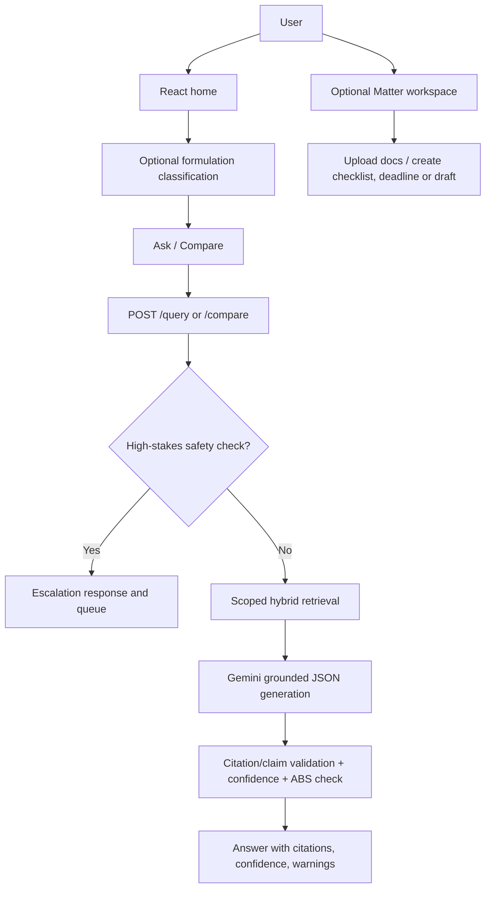
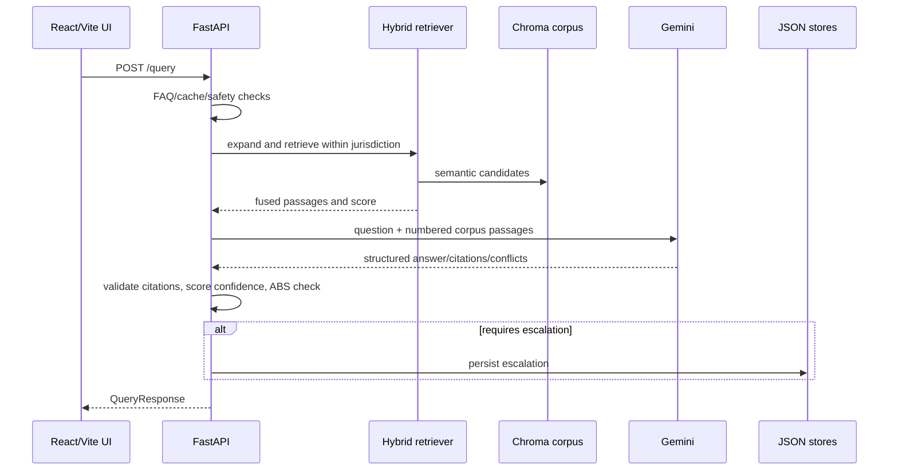
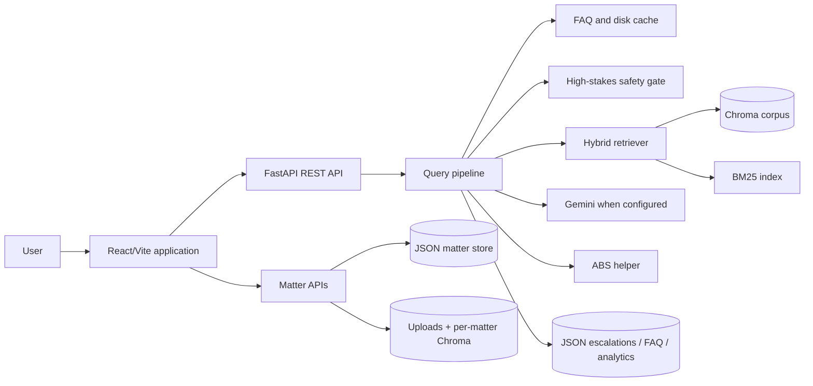

# IP2 — Technical Architecture & End-to-End System Analysis

## 1. Executive Summary

IP2 is a substantially broader **single-user legal-research workspace** than IP1. It combines a citation-grounded RAG API with formulation classification, an ABS helper, a matter/workspace system, document uploads, checklists, statutory deadlines, draft generation, feedback, aggregate analytics, a facilitator queue, a reviewed-FAQ shortcut, coverage visibility, fee calculations, jurisdiction comparison, and post-generation translation.

The backend is FastAPI. Its main corpus is stored in a persistent Chroma collection and retrieved through BM25 plus a SentenceTransformer embedding model. Gemini produces a JSON-shaped answer only when configured; otherwise the system deliberately escalates instead of generating an unsupported response. Most workspace data is stored as local JSON files, not in a multi-user database.

**Evidence status:** Findings reflect the IP2 source as inspected, including currently modified working-tree files. They do not prove a running deployment, live Gemini credentials, or corpus/legal completeness.

## 2. What the System Does

IP2 leads a user from a question or product/formulation profile into structured research and ongoing work management:

1. a rule-based decision tree classifies the formulation;
2. a query is retrieved from the corpus within the selected India/International scope;
3. high-stakes FTO, infringement, and fact-specific legality questions are forced to human escalation;
4. otherwise, Gemini receives up to six statutory passages and must return answer text, citations, inline claim markers, conflicts, and self-confidence;
5. deterministic logic then validates/recovers citations, calculates confidence, runs an ABS second pass when applicable, and records a human-review case when escalation is required;
6. a matter can retain a formulation profile, questions, uploads, checklists, deadlines, generated Markdown drafts, a TKDL-check result, and audit entries.

## 3. Verified Feature Set

| Feature | Execution path | Status |
|---|---|---|
| Formulation classifier | `/classify` → deterministic four-question decision tree | Verified |
| Citation-grounded RAG answer | `/query` → pipeline → Chroma/BM25 retrieval → Gemini JSON generation | Verified; Gemini-dependent |
| India/International scope | Request enum scopes corpus retrieval; comparison calls both scopes | Verified |
| FTO / infringement safety escalation | Regex guard returns escalation before generation | Verified |
| Citation / claim mapping | Generation validates citations against retrieved chunks and maps inline markers | Verified |
| ABS helper | Query pipeline performs a second ABS pass and adds available citations | Verified |
| Reviewed FAQ shortcut | FAQ token-overlap match can answer before retrieval/LLM | Verified |
| Query-response cache | Disk cache keyed by query/jurisdiction/category | Verified |
| Matters workspace | REST CRUD plus JSON-file persistence | Verified |
| Matter document upload | FastAPI background task extracts/chunks/indexes PDF, DOCX, TXT, or Markdown | Verified |
| Per-matter document retrieval | Separate Chroma collection; snippets go to generation as non-citable background | Verified |
| Checklists, deadlines, and drafts | Matter endpoints/services manipulate deterministic artifacts | Verified |
| TKDL cross-check | Builds search terms and reports `not_connected` | Verified scaffold; no live TKDL search |
| Facilitator queue and FAQs | JSON repositories plus manager-facing REST endpoints | Verified, no auth protection found |
| Analytics | Aggregate counters persisted locally; source says no query text/PII | Verified implementation intent |
| Translation | Translation endpoint/service exists | Verified adapter; live capability depends on configured provider/code path |
| State licensing directory | Static/optional state-rule overlays served via API | Verified |

## 4. User Flow

1. The user opens the Vite/React application and can navigate to Home, Classify, Ask, Result, Matters, Coverage, Compare, Fees, Facilitator, or Analytics pages.
2. In **Classify**, the client progressively submits the full answer dictionary to `/classify`. The backend returns the next question or a category/rationale.
3. In **Ask**, the user sends a question with India/International jurisdiction and optional formulation category to `/query`.
4. The backend first checks reviewed FAQs and the disk cache. A high-stakes FTO/infringement/fact-specific legality query receives an escalation response rather than a RAG answer.
5. Other queries are expanded, retrieved, given to Gemini together with corpus passages, then validated and returned with citations, claims, conflicts, confidence, ABS information, jurisdiction note, retrieval details, and possibly matter-document snippets.
6. A user can create a **Matter** to organise a product/formulation. There they can ask saved questions, upload documents, add a checklist/deadline, derive deadlines, create/download/delete a Markdown draft, view state authorities, and request a TKDL check.
7. If confidence is insufficient, the service creates an escalation record. The Facilitator UI/API can answer or dismiss it and optionally publish a reviewed FAQ.

## 5. End-to-End Technical Workflow

### Core query pipeline

`services/pipeline.py` is the central workflow. Its order matters:

- A reviewed FAQ can short-circuit the RAG call.
- A local disk query cache can also short-circuit it, except for matter questions.
- Query expansion runs before retrieval.
- Retrieval asks for eight candidates, excludes case-law chunks from Gemini context, and keeps up to six corpus passages for generation.
- Matter-upload snippets are context only: comments and code state that they must not become legal citations.
- Regex-based high-stakes detection bypasses generation and returns an escalation response.
- Generation failures, missing Gemini configuration, and no evidence also return a deterministic escalation stub.
- Citation validation only accepts sources/sections that map back to retrieved passages. Inline markers are remapped to final citation positions.
- Low retrieval score or no citations marks the response for escalation; a persisted escalation is created after the response.

## 6. System Architecture

| Component | Technology / implementation | Responsibility |
|---|---|---|
| Browser UI | React 19, React Router, native `fetch`, Vite | Screens, forms, API calls, matter workflows, result display |
| API | FastAPI, Pydantic, Uvicorn | Validated REST routes, CORS, startup indexing, background upload jobs |
| Corpus retriever | Chroma persistent client, SentenceTransformer, custom BM25/RRF | Search the curated legal corpus |
| Generation | Google Generative AI client | Produce constrained JSON answer only from supplied passages |
| Application services | Python modules under `services/` | Safety, confidence, ABS, case notes, coverage, cache, fees, drafts, deadlines, analytics, etc. |
| Matter-doc lane | Per-matter Chroma collection plus fallback term overlap | Retrieve user documents as non-citable background |
| Persistence | Local JSON document stores and disk cache | Matters, escalations, FAQs, analytics, drafts, document metadata/originals |

## 7. Component Breakdown

### Frontend

- `App.jsx` registers eleven routes. These are client routes; a deployment must configure SPA fallback separately for deep links.
- `api/client.js` centralizes the backend base URL, query API, matter APIs, facilitator APIs, document multipart upload, and error handling.
- `pages/Ask.jsx` and `Result.jsx` are the main research/result path; `Compare.jsx` is the side-by-side jurisdiction path.
- `pages/Matter.jsx` is the persistent work area; it uses many matter endpoints.
- `pages/Facilitator.jsx` is a human queue UI, but source inspection found no role/access restriction in front of its API.

### Backend

- `main.py` initializes the retriever at FastAPI startup and includes base, matter, and facilitator routers.
- `services/pipeline.py` co-ordinates answer assembly.
- `services/generation.py` is the grounded-Gemini contract and citation/claim reconciliation layer.
- `services/safety.py` blocks specific high-stakes question patterns.
- `services/classifier.py` is an explainable decision tree, not an LLM classifier.
- `services/matter_docs.py` performs the document lifecycle; `api/matters.py` uses FastAPI `BackgroundTasks` for processing after upload response.

## 8. Data Flow

### Curated corpus

Source PDFs/Markdown and cleaned source files live under `corpus/`. The ingestion scripts produce `backend/data/processed/chunks.jsonl` and document metadata. On startup, the retriever initializes a persistent Chroma collection in `CHROMA_DIR` and uses the configured SentenceTransformer to encode corpus chunks when required. BM25 is maintained alongside it and hybrid logic fuses results.

### Matter documents

The upload endpoint reads the file, stores its original bytes under the matter document directory, immediately returns an item in `processing` state, and schedules extraction/chunking/indexing in a FastAPI background task. The code supports PDF text layers, DOCX, TXT, and Markdown; it explicitly does not implement OCR. Extracted content and chunks are stored in JSON, and a separate Chroma collection named `matter_docs_<matter_id>` holds embeddings. If that retrieval lane is unavailable, query-time snippets fall back to term-overlap scoring.

### Workspace records

The generic `JsonStore` writes one JSON file per aggregate using a temporary file followed by `os.replace`. Matter, escalation, and FAQ repositories validate records with Pydantic. This is local single-user persistence: `local_owner` is a configured static owner identifier, not authenticated identity.

## 9. API Architecture

| Route group | Important endpoints | Purpose |
|---|---|---|
| Base research | `GET /health`, `POST /classify`, `POST /query`, `POST /compare`, `GET /chunk/{id}`, `GET /corpus` | Service status, classification, RAG, comparison, passage provenance, coverage |
| Guidance tools | `GET /fees`, `POST /fees/estimate`, `POST /abs-check`, `GET /state-rules`, `POST /translate`, `POST /feedback`, `GET /analytics` | Deterministic helper functions, translation, feedback, aggregate usage |
| Matter workspace | `POST/GET /matters`, `GET/PATCH/DELETE /matters/{id}`, `/questions`, `/documents`, `/checklist`, `/deadlines`, `/drafts`, `/tkdl-check` | Persistent product/matter work |
| Facilitator | `/escalations`, `/escalations/{id}/answer`, `/dismiss`, `/faq` | Queue review and reviewed FAQ management |

Exact request/response fields are declared in `backend/app/schemas.py`; `QueryRequest` carries question, jurisdiction, optional formulation category, optional context, and optional matter identifier. `QueryResponse` carries answer, citations, claims, conflicts, confidence, ABS fields, jurisdiction note, retrieval information, case notes, and document-context snippets as applicable.

## 10. Database & Storage Architecture

| Store | Use | Status |
|---|---|---|
| Chroma persistent store | Main legal corpus embeddings and metadata | Verified |
| Per-matter Chroma collections | User document chunks/embeddings | Verified |
| Processed JSONL/JSON | Corpus chunks/documents and validation artifacts | Verified |
| JSON aggregate directories | Matters, escalations, FAQs | Verified |
| Query cache files | Replay cached query responses | Verified |
| Draft Markdown files | Generated matter drafts | Verified |
| Original uploads/extracted JSON | Matter document persistence | Verified |

**Not found:** SQL database, migrations, authenticated user table, cloud object storage, Redis, Celery/RQ, or multi-process job queue.

## 11. AI/ML/RAG Architecture

### Verified

- Configuration defaults to `BAAI/bge-small-en-v1.5`; the `SentenceTransformer` loader can use a local-only model first and otherwise permit model loading. This is a real neural embedding path, unlike IP1’s TF–IDF-only vector layer.
- Chroma uses persistent local storage and cosine space. The retriever also calculates BM25 and applies hybrid fusion.
- `google-generativeai` is the generation dependency. The prompt requires JSON and tells the model to use only numbered context passages.
- Citation coercion discards model citations that do not match a retrieved source/section. If a confident answer lacks citations, recovery only picks from retrieved chunks.
- Case-law hits are separated from generation context and returned as notes.
- Query cache and reviewed FAQ responses reduce LLM/retrieval work under their documented conditions.

### Important limits

- A prompt and citation-validation logic reduce unsupported claims; they do not prove factual/legal correctness.
- Confidence is rule-based: weak top retrieval or no citations forces `escalate`. It is not a statistically calibrated probability.
- The TKDL API connector is expressly unimplemented even if its configuration exists.
- The configured corpus gaps explicitly include missing/full international ABS material, no case-law interpretation corpus, missing state-level rules, no amendment history, absent TKDL connection, and English-only source text. These are treated as declared gaps, not hidden limitations.

## 12. External Services & Integrations

| Service | Evidence | Status |
|---|---|---|
| Google Gemini | `gemini_client.py`, settings and generation pipeline | Implemented client; needs API key(s) |
| Hugging Face/SentenceTransformers model distribution | SentenceTransformer loader uses configured model name | Implemented local/runtime model loading path |
| Chroma | persistent client for corpus and matter documents | Implemented local storage, not a hosted service |
| TKDL | settings/scaffold | Not connected; no verified public connector |

## 13. Authentication & Authorization

**Not found in the IP2 source:** user registration, login, password hashing, JWT/OAuth validation, RBAC, tenancy enforcement, or a true facilitator authorization gate.

The configured `local_owner` stamps/filters matters as `local` until real authentication is added. CORS is configured and `allow_credentials=True`, but that setting does not supply authentication. In particular, facilitator endpoints are not protected by an inspected auth dependency.

## 14. Deployment & Infrastructure

**Observed:** development scripts run Uvicorn and Vite. The repository includes no verified Dockerfile, deployment blueprint, CI workflow, Vercel configuration, Render configuration, or deployed URL in the inspected root-level artifact inventory.

**Inferred operational requirement:** because Chroma, JSON records, cache files, drafts, and uploads are disk-backed, a deployable instance needs durable writable storage or the data will not survive ephemeral-instance replacement. This is an inference from the active file-store paths, not a configured cloud architecture.

## 15. Technical Stack

| Area | Verified technology |
|---|---|
| Frontend | React 19, React Router 7, Vite, CSS Modules |
| Backend | Python, FastAPI, Pydantic/Pydantic Settings, Uvicorn |
| Retrieval | ChromaDB, SentenceTransformers, `BAAI/bge-small-en-v1.5` default configuration, rank-bm25 |
| Generation | Google Generative AI / Gemini client |
| Documents | Pypdf, python-docx, FastAPI multipart uploads |
| Persistence | local JSON, JSONL, filesystem cache/drafts/uploads, persistent Chroma |
| Tests | Pytest and endpoint/service tests are present; not executed during this documentation review |

## 16. USP / Technical Differentiators

IP2’s verified technical differentiator is its combination of **grounded legal RAG with a usable matter workflow**. Instead of only returning an answer, it makes formulation classification, evidence visibility, conservative FTO/infringement escalation, ABS checks, matter records, uploaded product documents (kept non-citable), checklist/deadline/draft tools, and a reviewed-FAQ human loop part of the same local application.

The most defensible safety distinction is that the source deliberately refuses/escapes fact-specific FTO/infringement/legality questions rather than presenting retrieval as a legal clearance.

## 17. Video Feature Analysis

### Relationship of the supplied video to IP2

The supplied video visually presents an IP-SAKTI prototype, solution slides, chat demonstration, legal source view, research-tool modal, and high-level feasibility/impact slides. It does not identify an IP2 commit/revision. Therefore feature mapping below is limited to observable overlap; it does not assert that the video was recorded from this repository.

### Video features with verified IP2 equivalents

- Ayurveda/IP and regulatory Q&A supported by an evidence corpus.
- India/International jurisdiction distinction and comparison capability.
- Classification-oriented product/formulation flow.
- Source/citation display and research tooling.
- Two kinds of knowledge: domain/regulatory information are represented in the corpus, though IP2 implements one main corpus rather than IP1’s registered two-RAG connector architecture.
- Human-escalation concept has a more complete JSON-backed queue/FAQ implementation in IP2.

### Video-described or visually depicted items not verified as IP2 implementation

- User registration/account flow.
- Live multilingual voice delivery. IP2 has a translation endpoint but no verified voice route/input component.
- A live TKDL/patent-examiner prior-art integration.
- A deployed multi-agent/knowledge-graph system.

### Implemented in IP2 but not clearly demonstrated in the sampled video

- Matter workspace with durable local records, uploads, deadlines, and downloadable Markdown drafts.
- Forced high-stakes FTO/infringement escalation.
- Reviewed FAQ shortcut, local query cache, fee calculator, analytics, state authority directory, and document-context lane.

## 18. Implemented vs Mentioned vs Inferred

| Claim | Classification | Evidence / qualification |
|---|---|---|
| Hybrid semantic + keyword retrieval | Implemented | Chroma/SentenceTransformer plus BM25/hybrid modules |
| Gemini grounded answering | Implemented, configuration-dependent | Missing/unavailable Gemini returns escalation |
| TKDL prior-art search | Declared scaffold, not implemented | Always returns `not_connected` |
| Formulation classification | Implemented | Deterministic decision tree, not AI inference |
| Matter documents contribute background | Implemented | Retrieved snippets go to prompt but are forbidden as citations |
| Facilitator review is access controlled | Not found | Endpoints use no verified authorization |
| System is multi-user | Contradicted by design | Local static owner and file stores |
| Cloud deployment | Unknown | Deployment artifacts not found in the inspected root |

## 19. Important Code References

All paths are relative to `C:\Users\thaku\Desktop\OTHER_REPOS\ip2`.

- `backend/app/main.py` — FastAPI setup and startup index initialization.
- `backend/app/api/routes.py` — research/helper API routes.
- `backend/app/api/matters.py` and `facilitator.py` — workspace and review routes.
- `backend/app/services/pipeline.py` — core query flow.
- `backend/app/services/generation.py` — Gemini prompting and citation/claim validation.
- `backend/app/retrieval/{vector,bm25,hybrid,corpus}.py` — Chroma and hybrid search.
- `backend/app/services/{matter_docs,doc_retriever,doc_extract,safety,tkdl,classifier}.py` — key specialized behaviour.
- `backend/app/store/{json_store,repos}.py` — atomic local persistence.
- `frontend/src/api/client.js` and `frontend/src/pages/*` — actual client integration points.

## 20. Unknowns / Unverified Areas

- Validity/availability of Gemini keys and model name at runtime.
- Exact corpus coverage, source freshness, and legal accuracy; the project’s own config declares important gaps.
- Whether the current modified working tree has been tested or deployed.
- Whether translation currently uses an external service, a model, or returns its fallback in a running environment.
- Production backup, monitoring, file-virus scanning, rate limiting, authentication, authorization, and tenant isolation.
- Any claims of actual TKDL access, FTO analysis, or legal-clearance capability.

## 21. End-to-End Architecture Summary

IP2 is a local-file-centric application by design. Its strongest implemented chain is: scoped retrieval → strict grounded-generation contract → citation reconciliation → confidence/safety decision → optional matter/human workflow.
