# IP‑SAKTI Sahayak: System Architecture & User Workflow
### *Citation‑Grounded RAG Architecture for Ayurvedic Intellectual Property*

---

## 📐 System Architecture Diagram

```mermaid
%%{init: {
  'theme': 'dark',
  'themeVariables': {
    'darkMode': true,
    'background': '#070b14',
    'fontFamily': 'Fira Code, JetBrains Mono, monospace',
    'primaryColor': '#091e2b',
    'primaryTextColor': '#38bdf8',
    'lineColor': '#38bdf8'
  }
}}%%

flowchart LR
    %% External Actor
    User(["<b>Practitioners</b><br/>Lawyers · Innovators · MSMEs"]):::actorStyle

    %% Outer Boundary: IP-SAKTI Sahayak MVP
    subgraph MVP [" <b>IP-SAKTI Sahayak — Citation-Grounded MVP</b> "]
        direction LR

        %% UI & Gateway
        ReactUI["<b>React SPA</b><br/>Vite · Citations UI · Audio"]:::uiStyle
        FastAPI["<b>FastAPI Gateway</b><br/>REST :8000 · SSE Stream"]:::coreStyle
        PIIScrubber["<b>PII Scrubber</b><br/>DPDP Act Sanitizer"]:::guardStyle

        %% Retrieval & Processing
        subgraph Pipeline [" <b>Query & Retrieval Pipeline</b> "]
            direction TB
            HybridSearch["<b>Hybrid Retriever</b><br/>BGE-M3 (Dense) + BM25 (Lexical)"]:::coreStyle
            RRF["<b>RRF Fusion Engine</b><br/>Reciprocal Rank Fusion (k=60)"]:::coreStyle
            Reranker["<b>Cross-Encoder Reranker</b><br/>Skip threshold ≤ 0.25"]:::coreStyle
            Compressor["<b>Context Compressor</b><br/>Deduplication · 1500 Tokens"]:::coreStyle
            Gate{"<b>Relevance Gate</b><br/>Distance ≤ 0.65?"}:::gateStyle
            
            HybridSearch -->|"candidate pools"| RRF
            RRF -->|"top fused"| Reranker
            Reranker -->|"ranked chunks"| Compressor
            Compressor -->|"compressed ctx"| Gate
        end

        %% Storage Components
        subgraph Storage [" <b>Knowledge Storage</b> "]
            direction TB
            ChromaDB[("<b>ChromaDB</b><br/>1024-d BGE-M3")]:::storeStyle
            BM25Disk[("<b>BM25 Index</b><br/>Inverted Disk Index")]:::storeStyle
            Ingestion["<b>Ingestion Engine</b><br/>Sliding Window 500w/50w"]:::storeStyle
            
            Ingestion -->|"embed & build"| ChromaDB
            Ingestion -->|"tokenize & build"| BM25Disk
        end

        %% Generation & Verification
        subgraph GenEngine [" <b>Generation & Verification</b> "]
            direction TB
            GeminiLLM["<b>Grounded Generation</b><br/>Gemini 1.5/2.5 Flash (Key Pool)"]:::modelStyle
            ClaimVal["<b>Citation Validator</b><br/>Claim Extraction · NLI Entailment"]:::coreStyle
            Confidence["<b>Confidence Calculator</b><br/>4-Pillar Composite Scoring"]:::coreStyle

            GeminiLLM -->|"generated claims"| ClaimVal
            ClaimVal -->|"entailment metric"| Confidence
        end

        %% Safe Abstention Fallback
        Abstain["<b>Safe Abstention</b><br/>Direct Human Escalation<br/><i>(Bypasses LLM)</i>"]:::abstainStyle

        %% Persistent Audit
        AuditDB[("<b>SQLite DB & Audit Log</b><br/>Sessions · Latency · PII Logs")]:::storeStyle
    end

    %% ====================================================
    %% INTER-COMPONENT FLOW CONNECTORS WITH LABELS
    %% ====================================================
    User == "HTTPS" ==> ReactUI
    ReactUI == "query payload" ==> FastAPI
    FastAPI == "raw text" ==> PIIScrubber
    PIIScrubber == "sanitized query" ==> HybridSearch

    %% Retrieval connections from DB
    ChromaDB -. "dense vectors" .-> HybridSearch
    BM25Disk -. "sparse keywords" .-> HybridSearch

    %% Gate Dual-Branch Routing
    Gate == "PASS (Sim ≥ 0.65)<br/>grounded context" ==> GeminiLLM
    Gate -. "FAIL (Sim < 0.65)<br/>insufficient evidence" .-> Abstain

    %% Delivery paths
    Confidence == "cited answer + confidence cards" ==> ReactUI
    Abstain -. "safe refusal + facilitator escalation" .-> ReactUI

    %% Telemetry & Audit
    Confidence -. "log turn" .-> AuditDB
    Abstain -. "log abstention" .-> AuditDB

    %% ====================================================
    %% STYLING CLASSES (NEON TEAL, PURPLE, AMBER & NAVY)
    %% ====================================================
    classDef actorStyle fill:#1e1b4b,stroke:#818cf8,stroke-width:2px,color:#e0e7ff;
    classDef uiStyle fill:#032b30,stroke:#00f0ff,stroke-width:2.5px,color:#e0f7fa;
    classDef coreStyle fill:#06262d,stroke:#14b8a6,stroke-width:2px,color:#ccfbf1;
    classDef modelStyle fill:#2e1065,stroke:#a855f7,stroke-width:2px,color:#f3e8ff;
    classDef storeStyle fill:#0f172a,stroke:#6366f1,stroke-width:2px,color:#e0e7ff;
    classDef gateStyle fill:#3b0764,stroke:#c084fc,stroke-width:2.5px,color:#faf5ff;
    classDef guardStyle fill:#450a0a,stroke:#f87171,stroke-width:2px,color:#fee2e2;
    classDef abstainStyle fill:#3f1414,stroke:#ef4444,stroke-width:2px,stroke-dasharray: 4 4,color:#fecaca;
```



---

## 📦 High-Contrast ASCII System Architecture (README Ready)

```text
========================================================================================================================
                                       IP-SAKTI Sahayak — CITATION-GROUNDED RAG MVP
========================================================================================================================

  +-----------------+
  |  PRACTITIONERS  |
  | (Lawyers, MSMEs)|
  +--------+--------+
           |
           | [1] HTTPS (Natural Language Query)
           v
  +--------------------------------------------------------------------------------------------------------------------+
  |  INGRESS & PRIVACY GATEWAY                                                                                         |
  |                                                                                                                    |
  |  +-----------------------+      [2] JSON / SSE        +----------------------+      [3] Clean Query                |
  |  |  React SPA (Vite UI)  | -------------------------> |  FastAPI Gateway     | -----------------------+            |
  |  |  (Citations/Badges)   | <------------------------+ |  (Port :8000)        |                        |            |
  |  +-----------------------+   [11] Cited Answer        +----------------------+                        v            |
  +----------------------------------------------------------------------------------+   +--------------------------+  |
                                                                                     |   |       PII SCRUBBER       |  |
                                                                                     |   | (DPDP Act Sanitize Redact|  |
                                                                                     |   +------------+-------------+  |
                                                                                     |                |                |
  +----------------------------------------------------------------------------------+                | [4] Scrubbed   |
  |  HYBRID RETRIEVAL & RERANKING ENGINE                                                              v   Query        |
  |                                                                                                                    |
  |      +-------------------------+                 +------------------------+                                        |
  |      |   Chroma Vector Store   |                 |    BM25 Disk Index     |                                        |
  |      |   (BGE-M3 1024-d Dense) |                 |    (Lexical Sparse)    |                                        |
  |      +------------+------------+                 +-----------+------------+                                        |
  |                   |                                          |                                                     |
  |                   +-------------------+  +-------------------+                                                     |
  |                                       |  |                                                                         |
  |                                       v  v                                                                         |
  |                           +--------------------------+                                                             |
  |                           |     RRF FUSION (k=60)    |  ==> Reciprocal Rank Fusion of Dense + Sparse Candidates    |
  |                           +-------------+------------+                                                             |
  |                                         |                                                                          |
  |                                         v                                                                          |
  |                           +--------------------------+                                                             |
  |                           |   Cross-Encoder Rerank   |  ==> Deep Cross-Attention (Bypassed if top dist <= 0.25)    |
  |                           +-------------+------------+                                                             |
  |                                         |                                                                          |
  |                                         v                                                                          |
  |                           +--------------------------+                                                             |
  |                           |    Context Compressor    |  ==> Deduplication & Token Budgeting (<= 1500 tokens)       |
  |                           +-------------+------------+                                                             |
  |                                         |                                                                          |
  +-----------------------------------------|--------------------------------------------------------------------------+
                                            |
                                            v
                                 /---------------------\
                                <   RELEVANCE GATE      >
                                 \---------------------/
                                    /               \
              [5A] PASS: Distance <= 0.65            \ [5B] FAIL: Distance > 0.65
             (Sufficient Statutory Evidence)          \ (Insufficient Registers)
                           |                           \
                           v                            v (Dashed Abstention Path)
  +------------------------------------------------+   +---------------------------------------------------------------+
  |  GROUNDED REASONING & VALIDATION PIPELINE       |   |  SAFE ABSTENTION HANDLER (Zero-Hallucination Fallback)        |
  |                                                |   |                                                               |
  |  +------------------------------------------+  |   |  • Completely bypasses LLM generation                         |
  |  |  Gemini Grounded Generation              |  |   |  • Emits verified register safe disclaimer                    |
  |  |  (Strict System Instruction, Multi-Key)  |  |   |  • Returns direct Human Legal Facilitator escalation pathway  |
  |  +---------------------+--------------------+  |   |  • Confidence Score: 15% (Low - Mandatory Verification)       |
  |                        |                       |   +-------------------------------+-------------------------------+
  |                        | [6] Claims Draft      |                                   |
  |                        v                       |                                   |
  |  +------------------------------------------+  |                                   |
  |  |  Citation Validator (NLI Entailment)    |  |                                   |
  |  +---------------------+--------------------+  |                                   |
  |                        |                       |                                   |
  |                        | [7] Verified Support  |                                   |
  |                        v                       |                                   |
  |  +------------------------------------------+  |                                   |
  |  |  4-Pillar Composite Confidence Check    |  |                                   |
  |  |  (Retrieval 30% + Rerank 25% +          |  |                                   |
  |  |   Entailment 30% + Coverage 15%)         |  |                                   |
  |  +---------------------+--------------------+  |                                   |
  +------------------------|-----------------------+                                   |
                           |                                                           |
                           v [8] Validated Answer Payload                              v [9] Abstention Payload
  +--------------------------------------------------------------------------------------------------------------------+
  |  OUTPUT & AUDIT PERSISTENCE                                                                                        |
  |                                                                                                                    |
  |  +----------------------------------------------------+      [10] Telemetry Logs     +--------------------------+  |
  |  |  React Interface Delivery                          | ----------------------------> |  SQLite Audit DB         |  |
  |  |  • Formatted Markdown Statutory Answer             |                               |  (Turns, Latency,        |  |
  |  |  • Expandable Citation Cards (Act & Section)       |                               |   Confidence Scores,     |  |
  |  |  • Confidence Badge (High / Moderate / Low)        |                               |   PII Scrubbed Hashes)   |  |
  |  |  • Follow-Up Interactive Prompt Chips              |                               +--------------------------+  |
  |  |  • Statutory Legal Disclaimer                      |                                                            |
  |  +----------------------------------------------------+                                                            |
  +--------------------------------------------------------------------------------------------------------------------+
========================================================================================================================
```

---

## 🛠️ Technology Stack Breakdown

| Layer | Technologies & Models | Function in Pipeline |
| :--- | :--- | :--- |
| **Frontend & UI** | `React 18`, `Vite`, `TailwindCSS` / Vanilla CSS, `Lucide Icons` | Interactive query form, streaming SSE typewriter, expandable citation cards, confidence meter |
| **API Gateway & Routing** | `FastAPI (Python 3.11)`, `Uvicorn`, `Pydantic v2`, `Starlette SSE` | Async request handling, PII sanitization (DPDP compliance), SSE streaming |
| **Embeddings & Vector Engine**| `BGE-M3 (BAAI via Hugging Face API)`, `ChromaDB` (1024-dim) | 8192-token context window dense semantic search, multilinguality, and Indic IP term matching |
| **Lexical Search** | `BM25 (Rank-BM25)`, Disk-Persisted Inverted Index | Exact statutory section numbers (`Section 3(p)`, `Section 6 NBA`) and Act keyword matching |
| **Reranking & Compression** | `Cross-Encoder (ms-marco-MiniLM-L-6-v2)`, Custom Context Compressor | Deep semantic cross-attention re-scoring, token deduplication within 1500 token budget |
| **Grounded LLM Generation** | `Google Gemini 1.5 / 2.5 Flash`, `GeminiKeyPool` (Auto-Rotation) | Temperature 0.2, strictly-grounded statutory answers with zero external hallucinations |
| **Verification & Confidence**| `NLI Entailment Claim Verifier`, 4-Pillar Composite Engine | Claim extraction, textual entailment vs source chunks, composite confidence calculation |
| **Persistence & Audit** | `SQLite3`, `SQLAlchemy ORM` | Conversation sessions, user turns, latency tracking, and compliance audit trail |

---

## 📌 Guiding Operational Principles

> [!IMPORTANT]
> **"Retrieve first. Cite always. Abstain when evidence is insufficient."**
> 
> *Confidence represents factual evidence quality and citation support. It is not a guarantee of legal correctness and not the LLM’s self-reported certainty.*
