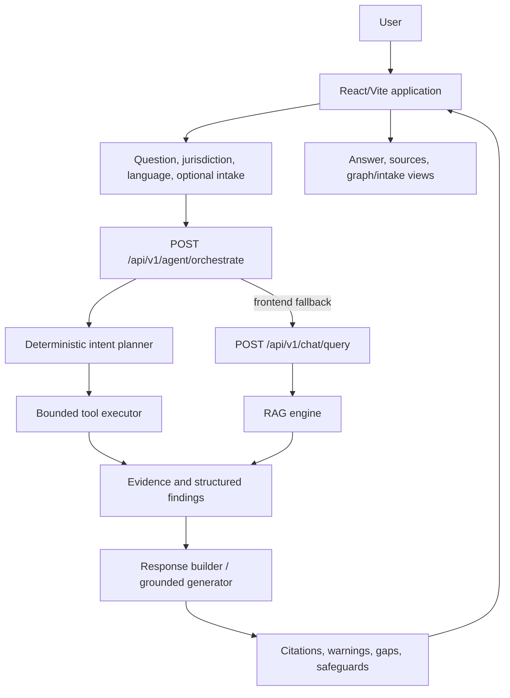
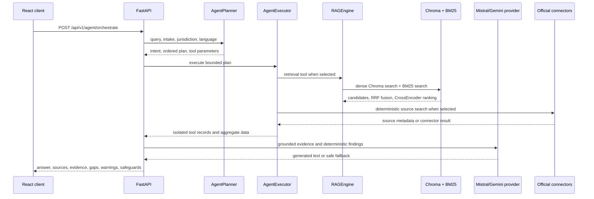
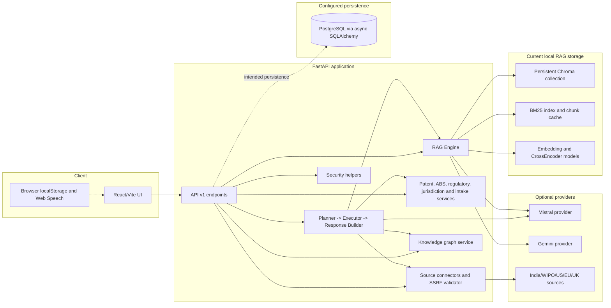
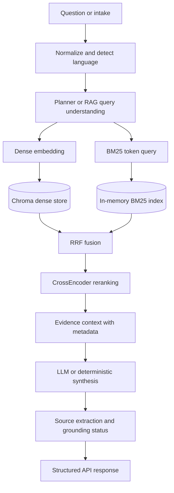
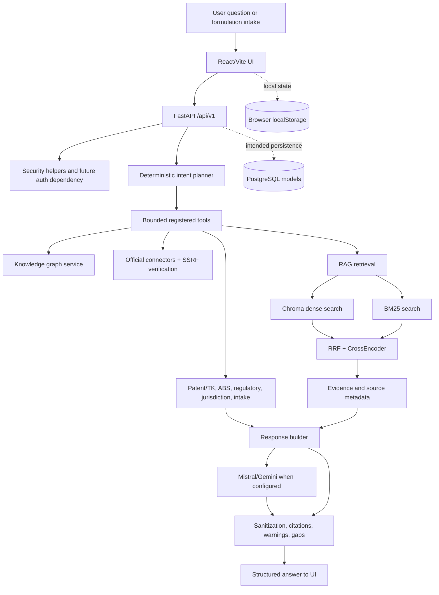

# IP3 — Technical Architecture & End-to-End System Analysis

## 1. Executive Summary

IP3 is a broad FastAPI and React application for Ayurvedic intellectual-property, traditional-knowledge, biodiversity, and AYUSH regulatory guidance. Its architecture combines a ChromaDB/BM25 hybrid RAG pipeline, CrossEncoder reranking, deterministic product and IP classifiers, a bounded multi-tool orchestrator, a rule-based knowledge-graph service, jurisdiction connectors, intake workflows, source verification, multilingual response handling, and a PostgreSQL-oriented SQLAlchemy model layer.

The most important implementation finding is that the repository contains two different levels of maturity. The RAG and deterministic statutory-analysis services are substantial and designed to return evidence and safeguards. Several surrounding product surfaces—authentication, chat-session persistence, user document upload, and some frontend graph calls—are incomplete or local-development oriented. The current code therefore represents a strong integrated prototype rather than a verified production system.

**Evidence status:** This document is based on the inspected working tree. It does not prove that external connectors are reachable, that database migrations have been applied, that credentials are configured, or that every frontend screen is backed by a live production endpoint.

## 2. What the System Does

The system accepts a natural-language question or a structured formulation intake. It classifies the likely legal or regulatory task, plans a bounded set of deterministic tools, retrieves statutory and traditional-knowledge evidence, builds a structured answer, and exposes provenance, warnings, missing facts, safeguards, and execution information.

The supported problem areas represented in code include:

- patentability and traditional-knowledge risk;
- intellectual-property route selection;
- product/formulation classification;
- biodiversity and access-and-benefit-sharing assessment;
- regulatory guidance for ASU medicines, extracts, Ayurveda Aahara, cosmetics, and export pathways;
- jurisdiction and foreign-filing analysis;
- knowledge-graph exploration;
- authoritative-source search and URL verification; and
- multilingual, citation-oriented RAG consultation.

The implementation is not a definitive legal-clearance engine. The response builder repeatedly identifies claim-specific facts, prior art, experimental evidence, applicant status, and official verification as necessary before a formal legal decision.

## 3. Verified Feature Set

| Feature | Evidence in source | Status |
|---|---|---|
| FastAPI API | `backend/app/main.py` and API v1 router | Implemented |
| React/Vite client | `frontend/src/` and Vite configuration | Implemented |
| Natural-language RAG | `RAGEngine`, Chroma vector store, BM25, reranker, generator | Implemented in local architecture |
| Dense retrieval | LangChain HuggingFace embeddings feeding Chroma | Implemented; default model is MiniLM unless environment overrides it |
| Keyword retrieval | In-memory `rank_bm25.BM25Okapi` index over chunk files | Implemented |
| Reciprocal Rank Fusion | `rag/retriever.py` | Implemented |
| CrossEncoder reranking | `rag/reranker.py` | Implemented; model/availability is environment-dependent |
| Legal query understanding | language detection, query expansion, intent extraction | Implemented |
| Controlled orchestration | deterministic planner, bounded executor, isolated tool errors | Implemented |
| LLM generation | Mistral provider by default, alternate Gemini configuration | Implemented conditionally; provider and credentials required |
| Deterministic fallback | response builder and generator fallbacks | Implemented, but one orchestrator fallback contains hard-coded statutory text and should remain under legal-content review |
| Citation/provenance response fields | schemas, context builder, response builder | Implemented in response contract |
| India/WIPO/US/EU/UK connectors | connector manager and connector modules | Implemented as connector layer; live freshness/network success unverified |
| SSRF and official-domain validation | `ssrf_validator.py` and source endpoints | Implemented |
| Product/IP/regulatory tools | registry plus domain services | Implemented as deterministic services |
| Knowledge-graph API | graph service and endpoints | Implemented as service/API; persistence is not established |
| User authentication | password/JWT helper code | Partial: register/login endpoints are explicit stubs |
| Chat persistence | SQLAlchemy models exist | Partial: current chat endpoints return transient/empty session data |
| User document uploads | endpoint exists | Not implemented: upload endpoint is a placeholder |
| PostgreSQL persistence | async engine and models | Declared/configured; schema migration and live operation not verified |
| Browser voice | Web Speech API client service | Implemented client-side where browser supports it |
| Production deployment | no verified deployment artifact or run proof | Unknown |

## 4. User Flow



The frontend first attempts the agent route and falls back to the chat route on failure. The visible interface stores theme, language, jurisdiction, recent queries, and saved answers in browser `localStorage`; that local storage is not equivalent to server-backed user history.

## 5. End-to-End Technical Workflow



For direct chat requests, `RAGEngine` detects the query language, obtains query-understanding data, retrieves and reranks chunks, builds an evidence context, invokes the configured provider with a timeout, sanitizes the response, extracts source markers, and returns a `GenerationResult`. Provider timeout, quota, or other failure produces a grounded-evidence fallback rather than silently treating an empty answer as successful generation.

The agent path is separate from the direct RAG path. `AgentPlanner` uses keyword and intake heuristics; `AgentExecutor` caps calls at eight, prevents duplicate tool execution, and isolates tool failures; `AgentResponseBuilder` aggregates structured tool data and official-source metadata.

## 6. System Architecture



This diagram describes code relationships, not a claim that every optional external service is active in production.

## 7. Component Breakdown

### Frontend

The React client is componentized around a dashboard, chat stream, prompt input, formulation intake, IP guidance, regulatory and knowledge-graph views, source/PDF modals, saved answers, documents, and notifications. It has multilingual UI dictionaries and browser-native speech recognition/synthesis. The app uses context state rather than a router library, and several workflows are controlled through tab/view state.

### API and services

`main.py` creates the FastAPI application, warms the retriever/vector store/reranker/BM25 at startup, and includes API v1 routers for auth, chat, agent orchestration, intake, classification, routing, patent/TK, ABS, regulation, jurisdiction, graph, guidance, documents, updates, and sources.

### Domain services

The service layer contains separate deterministic modules for classification, IP route selection, patent/TK assessment, ABS, regulatory guidance, jurisdiction, intake analysis, and graph construction. This makes the core decisions inspectable and reduces dependence on a generative agent for statutory routing.

### Orchestration

The “agent” is explicitly described in code as deterministic and non-generative. The planner builds a maximum-eight-step plan from lexical and intake signals. The registry exposes tools such as `classify_product`, `route_ip_type`, `assess_patent_tk`, `assess_abs`, `regulatory_guidance`, `jurisdiction_analysis`, `knowledge_graph`, `authoritative_source_search`, `rag_retrieval`, and `invention_intake_analysis`.

## 8. Data Flow



The BM25 index is built or loaded from chunk JSON files and cached locally. The Chroma store uses the embedding service’s configured model. The source metadata path is intended to preserve document, page, section, authority, and evidence identifiers, but the actual quality depends on the ingested chunk metadata.

The agent path adds an additional data flow: planner parameters are merged with initial request context, previous successful tool outputs are injected into later calls, and successful records are aggregated by tool name. Failed tool records are retained for the response audit but are not included as successful aggregate data.

## 9. API Architecture

The API is mounted under `/api/v1`; the application-level health route is `/api/health`. The principal route groups are:

| Group | Representative endpoints | Purpose |
|---|---|---|
| Auth | `/auth/register`, `/auth/login` | Present as stubs; not operational authentication flow |
| Chat | `/chat/sessions`, `/chat/query` | Session/query contract; current session persistence is incomplete |
| Agent | `/agent/orchestrate`, `/agent/tools`, `/agent/health` | Bounded deterministic orchestration |
| Intake | `/intake`, related analysis routes | Structured invention/formulation information |
| Classification | classification routes | Product and formulation classification |
| IP routing | `/ip-router` routes | Select likely protection route |
| Patent/TK | `/patent-tk` routes | Traditional-knowledge and patent assessment |
| ABS | `/abs` routes | Biodiversity and benefit-sharing assessment |
| Regulatory | `/regulatory` routes | AYUSH and product regulatory guidance |
| Jurisdiction | `/jurisdiction` routes | Country/region analysis |
| Knowledge graph | `/knowledge-graph/*` | Demo/build/intake graph and node navigation |
| Sources | source list/search/fetch/verify/document routes | Provenance and official-source operations |
| Documents | list/upload | Current upload implementation is a placeholder |
| Updates | update listing | Corpus/update metadata surface |

The route inventory is evidence of declared API surface, not proof that every route has complete authorization, persistence, or production data.

## 10. Database & Storage Architecture

`backend/app/db/session.py` creates an asynchronous SQLAlchemy engine from `settings.DATABASE_URL`, with an `AsyncSession` dependency. PostgreSQL-oriented models define users, chat sessions, chat messages, saved answers, knowledge-base documents/chunks, and user-uploaded documents. JSONB fields are used for citations, token usage, metadata, and extracted metadata.

The model layer is therefore designed for a relational production store. However, the inspected repository did not establish a complete migration/application lifecycle. Authentication endpoints are stubs, chat session routes do not currently read/write these models, and the document upload route returns a placeholder response. These are implementation gaps, not merely deployment settings.

The active RAG corpus is local Chroma plus chunk JSON files and a cached BM25 index. The frontend also stores interface state, recent queries, and saved answers in browser `localStorage`. The repository contains no verified Qdrant or Neo4j runtime integration in the active RAG path.

## 11. AI/ML/RAG Architecture

The active RAG chain is:

```text
query
  -> language detection and query understanding
  -> dense embedding through LangChain HuggingFaceEmbeddings
  -> Chroma similarity retrieval
  + BM25Okapi exact-term retrieval
  -> RRF fusion
  -> CrossEncoder reranking
  -> evidence context builder
  -> Mistral/Gemini provider
  -> sanitization and citation parsing
```

The key configuration caveat is model identity. `backend/app/core/config.py` defaults to `sentence-transformers/paraphrase-multilingual-MiniLM-L12-v2` with a 384-dimensional vector. The `.env.example` describes `BAAI/bge-m3` and a 1024-dimensional output, but that does not by itself change the runtime default. BGE-M3 is active only if the deployed environment sets the matching configuration and the Chroma collection was built with the same dimension/model. Mixing an existing 384-dimensional collection with a 1024-dimensional BGE-M3 query is invalid.

The CrossEncoder is lazy-loaded and reranks up to the configured candidate set. The provider layer supports Mistral through HTTP and includes Gemini configuration, but the active provider is configuration-dependent. Generation prompts explicitly require source-grounded language, uncertainty, statutory safeguards, and citations. Direct RAG has timeout/quota/error fallbacks; orchestration has a separate deterministic response builder.

## 12. External Services & Integrations

The connector manager registers India, WIPO, US, EU, and UK connectors. It can list curated source metadata, search connectors, validate URLs against an official-domain/SSRF allowlist, fetch an allowed source, check stale local copies, and obtain external evidence for target jurisdictions. The source code provides connector metadata and static/connector-level source records; a live network response was not verified during inspection.

LLM integration is provider-based. `llm_provider.py` supports configured Mistral and alternate Gemini paths. Hugging Face model loading is attempted in the RAG embedding layer and startup prewarm path, with offline/online handling in `main.py`.

The frontend’s voice feature uses browser Web Speech APIs. No verified server-side Bhashini, speech model, Qdrant, Neo4j, Supabase Storage, or cloud object-store implementation was found in the active IP3 source examined.

## 13. Authentication & Authorization

The repository contains password hashing and JWT signing/verification helpers and a SQLAlchemy `User` model. That is a security foundation, not a completed login system. The `/register` and `/login` route bodies are explicit stubs returning messages, and the inspected domain endpoints do not establish a consistent authenticated-user dependency. Consequently, user isolation, protected chat history, protected uploads, and role-based facilitator authorization must be treated as incomplete until verified in code and integration tests.

The FastAPI CORS configuration allows credentials and uses configured origins. CORS is not authentication and does not protect an endpoint. Production deployment must not expose the current stub state as if it were authenticated.

## 14. Deployment & Infrastructure

The application is structured for a FastAPI/Uvicorn backend and a Vite frontend. Startup prewarming loads heavyweight RAG objects, which affects cold-start time and memory. Local Chroma, BM25 cache files, local chunk data, and model caches are process/filesystem dependencies; they are not durable cloud persistence by themselves.

The repository inspection did not provide proof of a working production deployment, completed migrations, a production Docker image, or CI/CD. A deployable service would need:

- a stable `DATABASE_URL` compatible with async SQLAlchemy;
- a verified schema migration process;
- a persistent/externally managed corpus or a deployment image containing the corpus;
- model-loading and memory decisions appropriate to the host;
- configured LLM and source-provider credentials; and
- a production CORS allowlist and actual authentication flow.

## 15. Technical Stack

| Layer | Technology | Verified role |
|---|---|---|
| UI | React 18, Vite, Tailwind-style classes | Dashboard, chat, intake and research views |
| HTTP client | Axios/fetch | API calls; some frontend calls still use localhost directly |
| API | FastAPI, Uvicorn | REST service |
| Schemas | Pydantic | Request/response contracts |
| Relational layer | SQLAlchemy async, PostgreSQL drivers, JSONB | Declared persistence model |
| Dense vector store | ChromaDB via LangChain Chroma | Local semantic retrieval |
| Dense embeddings | LangChain HuggingFaceEmbeddings | Configurable local SentenceTransformer model |
| Sparse retrieval | `rank_bm25` BM25Okapi | Exact-term retrieval |
| Fusion | Custom RRF | Hybrid candidate fusion |
| Reranking | SentenceTransformers CrossEncoder | Candidate relevance ordering |
| Parsing/OCR | PyMuPDF, RapidOCR/Pillow dependencies | Document extraction capability |
| LLM | Mistral provider; Gemini alternative | Grounded synthesis when configured |
| Security | JWT helpers, bcrypt/passlib, SSRF validator | Foundation and source URL controls |
| Graph | In-process knowledge-graph service | Graph response construction and navigation |

## 16. USP / Technical Differentiators

The strongest technical differentiators are:

1. **Controlled orchestration:** the system calls a bounded, registered tool set through a deterministic planner rather than delegating statutory routing to an unconstrained autonomous agent.
2. **Hybrid retrieval:** semantic Chroma search is combined with BM25 exact-term search and RRF, which is useful for section numbers, forms, legal names, and technical terms.
3. **Domain-specific safety logic:** patent/TK, ABS, regulatory, jurisdiction, and intake services expose explicit missing facts and conditional conclusions.
4. **Official-source controls:** connector metadata, URL validation, jurisdiction routing, and source provenance are represented as first-class concepts.
5. **Graceful degradation:** provider failure or timeout can return retrieved evidence and a limitation rather than fabricating a complete answer.

These strengths should not be confused with a verified statutory guarantee. Corpus freshness, source completeness, legal correctness, and authenticated multi-user operation remain separate validation tasks.

## 17. Video Feature Analysis

The supplied SIH26045 video was reviewed visually using sampled frames. It appears to present **IP-SAKTI Sahayak**, a multilingual AYUSH/IP assistant. The visible architecture and demonstration themes include:

- user registration/query entry and language detection;
- a general-query branch versus an intent-routed branch;
- separate RAG areas for domain knowledge and legal/regulatory evidence;
- orchestration that fuses evidence, deduplicates/ranks citations, and returns an answer;
- statutory PDF/source viewing and research-oriented tools; and
- a roadmap including a knowledge graph, human-expert escalation, and broader multilingual/voice delivery.

The visual video architecture maps well to IP3’s deterministic planner, domain services, hybrid RAG, source connectors, and graph API. IP3 is more explicit in code about bounded tool calls and statutory safeguards. The video does not identify a repository revision and was not treated as proof that every visual feature is implemented in IP3. Audio was not transcribed in this inspection, so no claim here is based on unverified spoken wording.

## 18. Implemented vs Mentioned vs Inferred

| Classification | IP3 finding |
|---|---|
| Implemented | FastAPI route registration, deterministic planner/executor, domain services, Chroma/BM25/RRF/CrossEncoder path, source connector manager, SSRF validation, response safeguards, React views, browser speech support |
| Declared/configured | PostgreSQL models, JWT security helpers, Mistral/Gemini alternatives, Hugging Face model configuration, OCR dependencies, external connector access |
| Partial | Authentication, chat persistence, graph persistence, document uploads, production source freshness, multilingual provider operation |
| Inferred | Intended production architecture appears to be authenticated PostgreSQL-backed workspaces with official-source connectors and a richer graph; source code alone does not prove deployment or complete migrations |
| Unknown | Live credentials, database schema state, external-source response quality, production corpus contents, deployment health, actual frontend production base URL, and whether BGE-M3 is consistently used for all indexed vectors |

## 19. Important Code References

| Area | Reference |
|---|---|
| Application startup and router mounting | `backend/app/main.py` |
| Runtime defaults and environment settings | `backend/app/core/config.py` |
| JWT/password helpers | `backend/app/core/security.py` |
| Database engine/session | `backend/app/db/session.py` |
| SQLAlchemy base and models | `backend/app/db/base.py`, `backend/app/models/` |
| Agent API | `backend/app/api/v1/endpoints/agentic.py` |
| Agent planning/execution | `backend/app/services/agent_planner.py`, `agent_executor.py` |
| Tool registry | `backend/app/services/agent_tool_registry.py` |
| Structured statutory response | `backend/app/services/agent_response_builder.py` |
| Direct RAG coordinator | `backend/app/services/rag/engine.py` |
| Retrieval fusion | `backend/app/services/rag/retriever.py` |
| Dense store | `backend/app/services/rag/vectorstore.py` |
| Embedding configuration | `backend/app/services/rag/embeddings.py` |
| BM25 | `backend/app/services/rag/bm25.py` |
| Reranking and generation | `backend/app/services/rag/reranker.py`, `generator.py` |
| External sources | `backend/app/services/connectors/manager.py` and connector modules |
| Source security | `backend/app/core/ssrf_validator.py` |
| Knowledge graph | `backend/app/services/knowledge_graph_service.py`, graph endpoint |
| Frontend API and orchestration fallback | `frontend/src/services/api.js`, `frontend/src/context/AppContext.jsx` |
| Frontend graph calls | `frontend/src/components/views/KnowledgeGraphView.jsx` |
| Placeholder document upload | `backend/app/api/v1/endpoints/documents.py` |

## 20. Unknowns / Unverified Areas

- The effective deployed embedding model and vector dimension are unknown until the runtime environment and Chroma collection metadata are inspected together.
- The `.env.example` BGE-M3 declaration is not sufficient evidence that the default MiniLM/384 configuration has been replaced.
- No complete authentication flow, user dependency, role enforcement, or password persistence was verified.
- SQLAlchemy models do not prove that PostgreSQL tables exist or that migrations run during deployment.
- The document upload route is not a working storage/indexing implementation.
- Connector modules do not prove current official content, successful network retrieval, or legal completeness.
- The graph service does not prove a persistent Neo4j or relational knowledge graph.
- Local Chroma, chunk JSON, BM25 cache, and model caches may not survive an ephemeral deployment filesystem.
- Several frontend features may display useful UI around services whose server implementation is still a stub or local-only.
- No production latency, memory, concurrency, security, or citation-accuracy measurements were supplied by the source.

## 21. End-to-End Architecture Summary



In one sentence: IP3 is a domain-specific, citation-oriented AYUSH/IP assistant with a strong deterministic orchestration and local hybrid-RAG core, surrounded by partially implemented production foundations. Its next reliability priorities are to lock the embedding model/dimension, complete authenticated persistence, replace document-upload stubs, externalize durable corpus/storage, and verify every source and deployment path before presenting it as a production government service.
