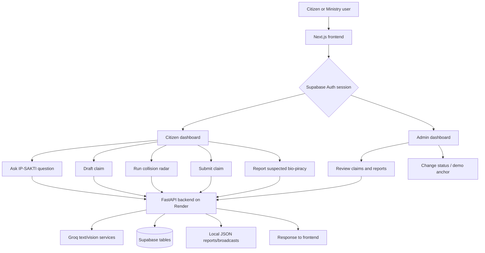
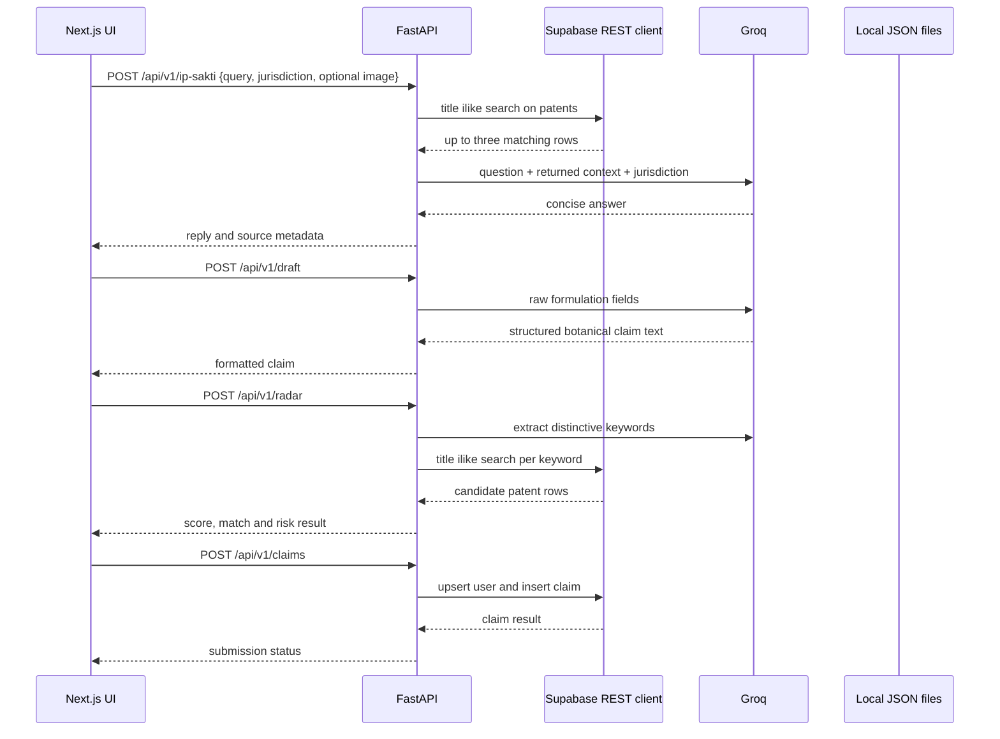
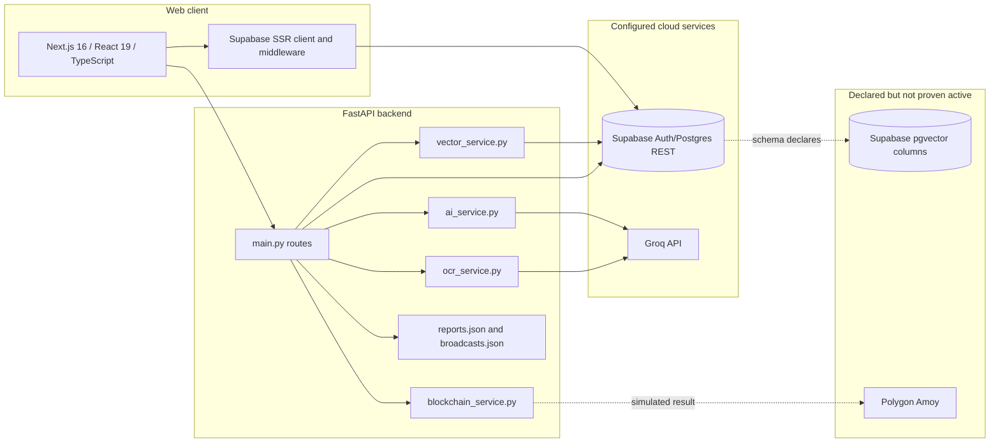
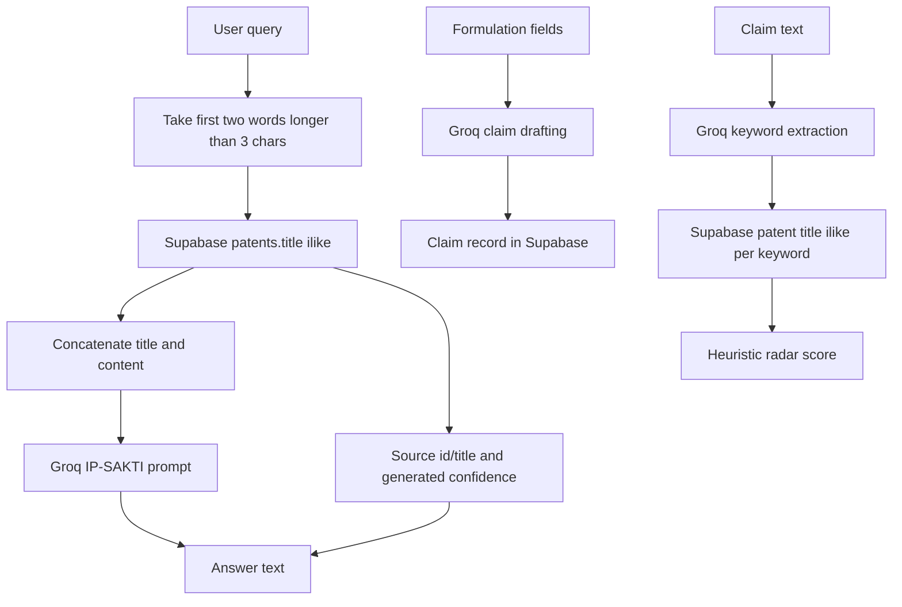
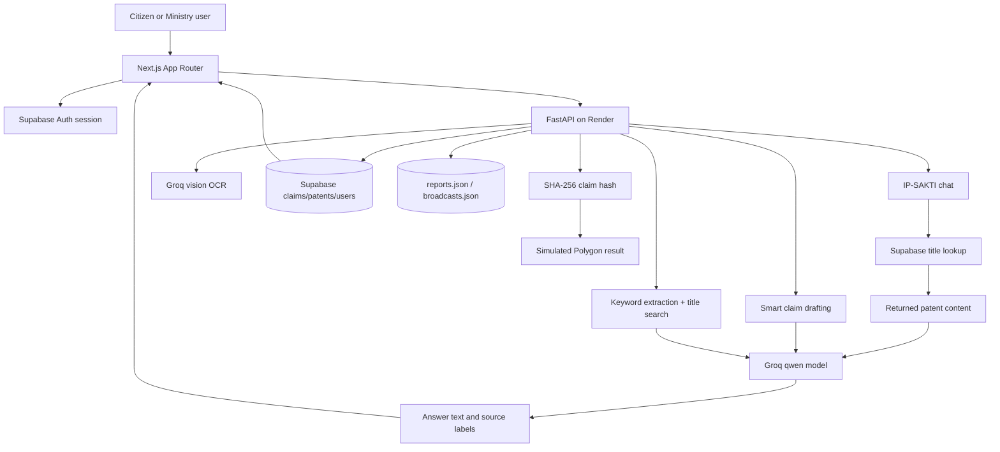

# ROOT-CLAIM — Technical Architecture & End-to-End System Analysis

## 1. Executive Summary

Root-Claim is a separate SIH26045 prototype for IP-SAKTI Sahayak. It combines a Next.js citizen/admin frontend, a FastAPI backend, Supabase authentication and database access, Groq-based drafting/chat/vision calls, a basic Supabase-backed text retrieval path, an OCR endpoint, a claim-submission workflow, an administrator review console, a bio-piracy report flow, and a proof-of-origin hash endpoint.

The repository’s implemented architecture is materially simpler than its README’s “enterprise-grade” description. The verified RAG path performs a limited title `ilike` search over the Supabase `patents` table and passes matching content to Groq. The patent collision radar asks Groq for a few keywords and performs title substring searches; the inspected code does not execute vector similarity despite the schema declaring `vector(384)` columns. The blockchain service returns a simulated Polygon-shaped transaction result and does not submit an on-chain transaction.

**Evidence status:** Findings are based on the inspected source tree. The README, presentation material, and code are treated separately. Supabase tables, RLS policies, deployed services, environment values, and live API responses were not independently verified.

## 2. What the System Does

Root-Claim presents two user roles:

- a citizen/practitioner interface for asking IP questions, drafting a claim from traditional-knowledge input, running a prior-art/collision pre-check, submitting a claim, reporting suspected bio-piracy, and viewing personal status; and
- a Ministry/admin interface for viewing claims, reviewing threat reports, enhancing broadcast messages, changing claim status, and initiating the demo proof-of-origin action.

The platform also includes an OCR/digitization endpoint for uploaded images and a legal-information section in the frontend. The intended subject is protection and documentation of Ayurvedic/traditional knowledge, but the current implementation is a hackathon prototype with several explicit demo fallbacks and hard-coded defaults.

## 3. Verified Feature Set

| Feature | Code evidence | Status |
|---|---|---|
| Public landing page | Next.js `frontend/src/app/page.tsx` | Implemented |
| Supabase browser authentication | signup/login pages and Supabase clients | Implemented client path; backend authorization is not verified |
| Citizen dashboard | `citizen-dashboard/page.tsx` | Implemented UI and API calls |
| Admin dashboard | `admin-dashboard/page.tsx` | Implemented UI; role protection must be verified |
| IP-SAKTI chat | `/api/v1/ip-sakti` | Implemented with Groq and retrieved context |
| RAG context lookup | `vector_service.get_rag_context` | Implemented as limited title substring search, not verified vector search |
| AI claim drafting | `/api/v1/draft` | Implemented through Groq text generation |
| Claim submission | `/api/v1/claims` | Implemented through Supabase tables when configured |
| Claim status review | `PATCH /api/v1/claims/{claim_id}` | Implemented; promotes verified claims into `patents` table |
| Collision radar | `/api/v1/radar` | Implemented as keyword extraction plus title search; not a full semantic patent search |
| Bio-piracy reports | `/api/v1/reports` and local `reports.json` | Implemented but local-file backed and unauthenticated in backend code |
| OCR/digitization | `/api/v1/ocr` | Implemented through Groq vision JSON response |
| Proof-of-origin hash | `/api/v1/anchor` | SHA-256 implemented; blockchain anchor is simulated |
| Supabase database access | Python Supabase client | Implemented conditionally when URL/key exist |
| Vector schema | `vector(384)` in SQL | Declared; active vector query/write path not verified |
| RLS | README says intended | Not present in inspected schema; explicitly noted as future setup |
| Backend authentication | Backend does not validate Supabase JWT on routes | Not implemented/verified |

## 4. User Flow



Supabase Auth is used by the frontend for signup, password login, session refresh, user metadata, and logout. The backend endpoints accept user IDs in request bodies or URL paths, but the inspected backend does not establish the logged-in Supabase user from a verified bearer token. That distinction is important for access control.

## 5. End-to-End Technical Workflow



For image input, the backend accepts base64 data, converts the first PDF page to JPEG when needed, and passes the resulting image to the Groq multimodal request. For OCR, it reads the uploaded image bytes and asks the Groq vision model for strict JSON fields such as herbs, symptoms, steps, confidence, and raw text.

## 6. System Architecture



The backend has a permissive CORS configuration (`allow_origins=["*"]` with credentials enabled). It should be treated as development/hackathon configuration until restricted to the real frontend origin and paired with verified authorization.

## 7. Component Breakdown

### Frontend

The frontend is a Next.js App Router project with separate landing, signup, login, dashboard, citizen-dashboard, admin-dashboard, and legal pages. Supabase browser/server/middleware utilities are present. The citizen screen directly calls the Render backend for drafting, radar, claims, reports, and chat. The admin screen directly calls the same backend for claims, reports, stats, broadcasts, and anchoring.

### Backend

`backend/main.py` is a single FastAPI module containing application setup, Pydantic request classes, Supabase initialization, local JSON persistence, and all endpoint functions. The service modules isolate Groq prompts, retrieval/radar operations, OCR, and hash/anchor behavior, but route authentication and policy enforcement remain in the monolithic endpoint layer.

### AI services

`ai_service.py` contains the smart drafting prompt and the IP-SAKTI answer prompt. Both calls use the Groq client and `qwen/qwen3.8-27b` in the inspected code. `ocr_service.py` uses the same Groq client with an image payload and requested JSON output.

## 8. Data Flow



The active chat retrieval is lexical and narrow. It does not show an embedding call, vector similarity operator, chunk-level retrieval, metadata filter, or reranker. The SQL schema’s vector columns are therefore a declared capability rather than evidence of an active vector RAG implementation.

The radar’s similarity score is computed from keyword-match logic and additional heuristics. A “confidence” value attached to chat sources is generated randomly within a range in the inspected service; it is not a calibrated retrieval probability.

## 9. API Architecture

| Route | Purpose | Verified behaviour |
|---|---|---|
| `GET /` | Backend root | Returns running message |
| `GET /health`, `/api/v1/health` | Health | Returns status and Groq-key presence |
| `GET /api/v1/stats` | Global stats | Supabase patent count when available; reports count from local JSON |
| `GET /api/v1/user-stats/{user_id}` | Citizen counts | Reads claims filtered by supplied user ID |
| `POST /api/v1/ip-sakti` | Chat | Limited Supabase lookup plus Groq response |
| `POST /api/v1/draft` | Claim drafting | Groq structured draft |
| `POST /api/v1/radar` | Collision radar | Groq keywords plus title search |
| `POST /api/v1/ocr` | Manuscript OCR | Groq vision JSON |
| `POST /api/v1/claims` | Create claim | Supabase insert; attempts user upsert |
| `GET /api/v1/claims` and `/{user_id}` | Claims | Supabase reads |
| `PATCH /api/v1/claims/{claim_id}` | Status update | Updates claim and may mirror verified claim to patents |
| `POST/GET/DELETE /api/v1/reports` | Reports | Local JSON file |
| `POST/GET/DELETE /api/v1/broadcasts` | Broadcasts | Local JSON file |
| `GET /api/v1/patents` | Patent list | Supabase patents plus anchored-claim projection |
| `POST /api/v1/anchor` | Proof-of-origin action | SHA-256 plus simulated transaction response |
| `POST /api/v1/enhance-broadcast` | Admin message rewrite | Groq text call |

The route list shows no backend dependency that verifies a Supabase access token and derives the user identity from it. Passing `user_id` from the browser is not equivalent to authenticated authorization.

## 10. Database & Storage Architecture

`backend/init_schema.sql` enables `vector` and declares these public tables:

- `users`, containing a UUID, email, name, role, and timestamps;
- `claims`, containing raw and AI-formatted claim text, status, collision score, blockchain hash, and user linkage;
- `patents`, containing patent metadata/content and a `vector(384)` embedding column; and
- `ip_laws`, containing law metadata/content and a `vector(384)` embedding column.

The SQL comments identify the 384-dimensional columns as an all-MiniLM-L6-v2 design. The runtime `vector_service.py` does not use a vector operator or write embeddings. It queries `patents.title` with `ilike`.

There are also local JSON files: `backend/reports.json` is initialized and capped at 100 records, while `broadcasts.json` is read/written relative to the process working directory. These files are ephemeral or instance-local on most cloud web services and are not reliable shared persistence.

Supabase client configuration is used in both frontend and backend. The frontend uses the publishable/anon key for browser Supabase operations. The backend uses `SUPABASE_KEY`; whether this is a service-role key or anon key is environment-dependent and must be handled securely.

## 11. AI/ML/RAG Architecture

The implemented chat sequence is:

```text
user query
  -> first two words longer than three characters
  -> title substring lookup in Supabase patents
  -> concatenate matched title/content
  -> Groq qwen/qwen3.8-27b prompt
  -> answer with prompt-level jurisdiction rules
```

The prompt instructs the model to discuss Indian or international IP frameworks depending on jurisdiction, classify products when asked, mention the portal features, and include a legal disclaimer for legal/patent advice. The model is not protected by a verified citation validator, answer-evidence checker, or refusal gate in this repository.

The drafting path asks Groq to output title, abstract, botanical ingredients, preparation method, and traditional claim. It can return a rejection string for nonsensical or unsafe input. This is a prompt rule, not a deterministic legal patentability test.

The collision radar first asks Groq for three distinctive keywords and then searches patent titles. It is useful as a prototype pointer but should not be labelled a complete novelty, FTO, or patent-infringement determination.

## 12. External Services & Integrations

| Service | Runtime use | Evidence status |
|---|---|---|
| Supabase Auth | Frontend signup/login/session/logout | Implemented client path |
| Supabase Postgres REST | Claims, patents, users, counts, chat context lookup | Implemented conditionally |
| Groq | Chat, drafting, OCR, radar keyword extraction, broadcast enhancement | Implemented conditionally |
| Polygon | Intended proof-of-origin target | No transaction submission; result is simulated |
| pgvector | Declared in schema | No active vector query/write verified |
| Render | Intended backend host and hard-coded frontend URL | Deployment state not independently verified |
| Vercel | Intended Next.js host | Deployment state not independently verified |

## 13. Authentication & Authorization

The frontend has real Supabase Auth calls: email/password signup, password login, user lookup, metadata update, session middleware, and logout. This establishes a browser authentication experience.

The backend routes, however, do not show a Supabase JWT verification dependency. Several routes accept a caller-supplied `user_id`, and admin endpoints are not visibly restricted by role. The backend also uses permissive CORS. Therefore the repository does not yet demonstrate server-enforced citizen/admin separation. RLS is mentioned in the README but the inspected `init_schema.sql` only says it should be configured later.

## 14. Deployment & Infrastructure

The intended deployment is a Next.js frontend on Vercel and a FastAPI/Uvicorn backend on Render. The README’s local commands are `npm install`/`npm run dev` for the frontend and `uvicorn main:app --reload --port 8000` for the backend.

The backend has no Docker or process manager requirement beyond Uvicorn in the inspected files. It writes local JSON files at runtime and performs external LLM/database calls. A Render restart or multiple instances can lose or diverge local report/broadcast state.

Required deployment checks include:

- configure `GROQ_API_KEY`, `SUPABASE_URL`, `SUPABASE_KEY`, and frontend public Supabase variables;
- ensure the backend working directory is `backend` or adjust the Uvicorn module path;
- set the frontend API base URL consistently instead of embedding a stale Render hostname;
- restrict CORS to the actual Vercel origin;
- apply Supabase schema and RLS policies; and
- decide whether local JSON data is replaced by database tables.

## 15. Technical Stack

| Layer | Technology | Verified role |
|---|---|---|
| Frontend | Next.js 16.3, React 19, TypeScript | App Router UI |
| Styling/UI | Tailwind CSS 4, Framer Motion, Lucide, Three.js | Visual interface and effects |
| Auth | Supabase SSR/client libraries | Browser authentication/session handling |
| Backend | FastAPI, Uvicorn, Pydantic | REST API |
| Database client | Python Supabase SDK | Postgres REST access |
| Database | Supabase PostgreSQL | Claims, patents, users and laws schema |
| Vector schema | pgvector `vector(384)` | Declared schema only; not active in inspected retrieval code |
| LLM | Groq `qwen/qwen3.8-27b` | Draft, chat, radar keyword extraction, broadcast rewrite |
| Vision/OCR | Groq multimodal request | Image manuscript extraction |
| PDF processing | PyMuPDF | First-page PDF-to-JPEG conversion in chat |
| Blockchain library | Web3 dependency | Initialized conditionally, not used for real anchoring |
| Hashing | Python SHA-256 | Claim payload fingerprint |

## 16. USP / Technical Differentiators

The demo’s differentiators are product-oriented rather than retrieval-engineering oriented:

1. It combines public citizen claim drafting with a Ministry-facing review/verification workflow.
2. It connects traditional-knowledge claims, bio-piracy reports, and a planned proof-of-origin story in one interface.
3. It provides separate citizen and admin dashboards with Supabase Auth on the frontend.
4. It includes a multilingual/jurisdiction-aware prompt for IP-SAKTI and a vision-assisted manuscript path.
5. It is lightweight enough to demonstrate quickly because heavy local embedding inference is avoided in the active backend path.

The trade-off is that the current RAG, collision radar, access control, and blockchain features are not yet strong enough to support claims of complete statutory search, FTO, novelty determination, immutable anchoring, or zero hallucination.

## 17. Video Feature Analysis

The supplied SIH26045 video appears to show the same overall IP-SAKTI concept: an AYUSH/traditional-knowledge assistant, jurisdiction-aware legal guidance, citations/source viewing, an orchestrated RAG design, a knowledge-graph roadmap, human escalation, and multilingual/voice ambitions.

Root-Claim maps to the visible concept through its citizen/admin dashboards, IP-SAKTI chat route, drafting flow, collision radar, OCR, reports, claim queues, and source/legal pages. It adds a concrete claim-submission and hash/anchor demonstration that is not the central focus of the other inspected repositories.

The mapping has important limitations: the video’s diagram suggests separate domain and legal evidence RAG components and stronger citation orchestration, while Root-Claim’s active chat lookup is a small Supabase title search. The video was visually reviewed from sampled frames; audio was not transcribed, and the video cannot prove code execution or production readiness.

## 18. Implemented vs Mentioned vs Inferred

| Classification | Finding |
|---|---|
| Implemented | Next.js UI, Supabase frontend auth calls, FastAPI routes, Groq drafting/chat/OCR, Supabase claim/patent operations, local report/broadcast storage, SHA-256 generation |
| Declared but not active in inspected path | pgvector similarity search, full patent semantic retrieval, Polygon transaction anchoring, continuous USPTO/EPO surveillance, complete TKDL integration |
| Partial | RAG citations, collision radar, role separation, user persistence, admin authorization, source provenance, production storage |
| Inferred | The project intends to evolve into a dual-role Ministry platform backed by Supabase and external AI services |
| Unknown | Actual Supabase schema/RLS, production environment values, live Groq limits, deployment health, corpus contents, patent data provenance, and whether any external ingestion job exists outside this repository |

## 19. Important Code References

| Area | Reference |
|---|---|
| FastAPI routes and Supabase initialization | `backend/main.py` |
| Chat prompts and drafting | `backend/services/ai_service.py` |
| Chat context and collision radar | `backend/services/vector_service.py` |
| OCR | `backend/services/ocr_service.py` |
| Hash/anchor behaviour | `backend/services/blockchain_service.py` |
| Declared database/vector schema | `backend/init_schema.sql` |
| Backend dependencies | `backend/requirements.txt` |
| Next.js dependencies | `frontend/package.json` |
| Supabase browser client | `frontend/src/utils/supabase/client.ts` |
| Supabase server client | `frontend/src/utils/supabase/server.ts` |
| Session middleware | `frontend/src/utils/supabase/middleware.ts` |
| Citizen workflow | `frontend/src/app/citizen-dashboard/page.tsx` |
| Admin workflow | `frontend/src/app/admin-dashboard/page.tsx` |
| Signup/login | `frontend/src/app/signup/page.tsx`, `frontend/src/app/login/page.tsx` |

## 20. Unknowns / Unverified Areas

- The active vector database is not established; schema columns do not prove vector operations.
- The RAG context lookup is not chunked, reranked, citation-validated, or score-calibrated in the inspected code.
- The displayed confidence values in `vector_service.py` are random presentation values, not measured confidence.
- The collision radar is not a complete prior-art, novelty, or FTO search.
- The returned Polygon transaction hash is simulated and `is_simulation` is true.
- Backend routes do not visibly validate Supabase JWTs or enforce citizen/admin roles.
- RLS policies were not present in the inspected initial schema.
- Local reports and broadcasts are not durable shared cloud storage.
- Backend exceptions may expose raw error strings in HTTP responses.
- CORS is permissive and should not be considered production-safe.
- No production deployment, database migration run, or end-to-end live test was verified.

## 21. End-to-End Architecture Summary



In one sentence: Root-Claim is a credible hackathon product prototype with a useful citizen-to-Ministry workflow, but its active retrieval is lexical and limited, authentication is not enforced server-side, local JSON is not durable cloud persistence, and blockchain anchoring is simulated; those facts must be made explicit before presenting it as a production-grade statutory or prior-art engine.
