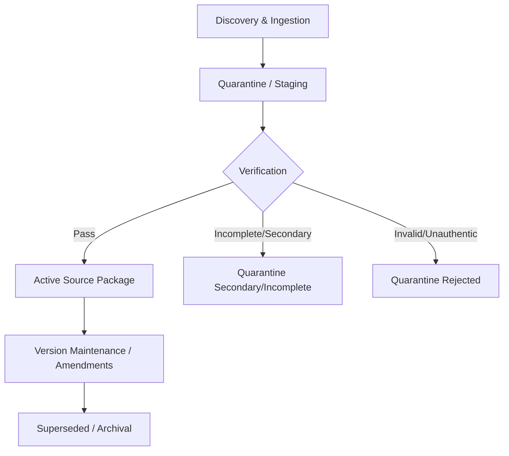

# Source Lifecycle Policy

This document outlines the end-to-end lifecycle of legal, regulatory, and technical sources in the IP-SAKTI Sahayak knowledge base.

## 1. Lifecycle Stages

### Stage 1: Ingestion & Quarantine
All newly discovered documents enter `knowledge-base/quarantine/pending-verification/` until their authenticity, issuing authority, and gazette references are verified.

### Stage 2: Verification
A source must be verified against official government gazettes, court portals, or treaty depositaries before graduation to `sources/`.

### Stage 3: Active Status
Once verified, the source package is created with:
- `source.yaml` (metadata)
- `current.yaml` (pointer to active version)
- `versions/<version_id>/original/` (immutable PDF with SHA-256 checksum)

### Stage 4: Supersession & Amendments
When an Act or Rule is amended, a new version folder is added under `versions/`. The `supersedes` field in `source.yaml` tracks lineage. Old versions are NEVER deleted.
